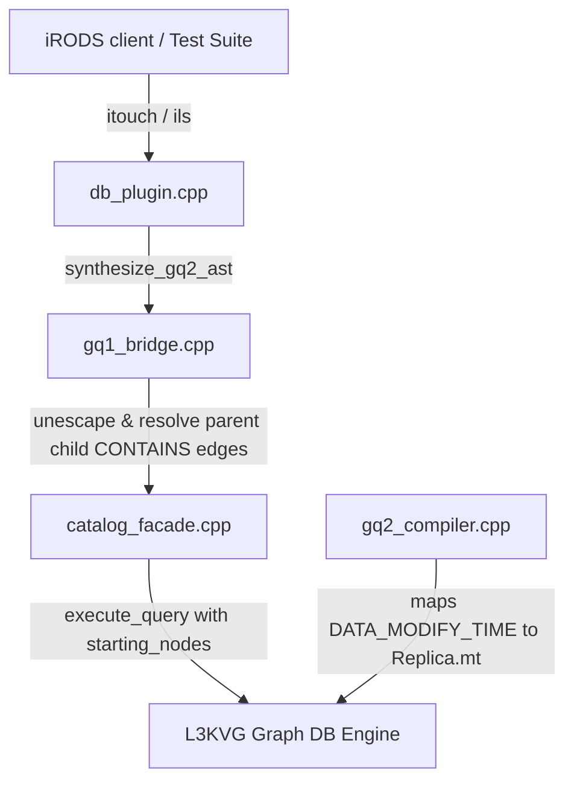

# QA Completion for iRODS L3KVG Database Plugin

> **For agentic workers:** REQUIRED SUB-SKILL: Use superpowers:subagent-driven-development to implement this plan task-by-task. Steps use checkbox (`- [ ]`) syntax for tracking.

**Goal:** Resolve remaining baseline failures in `test_ils` (invalid replica number checks, collection parent lookups, and single-quote escaping) to successfully complete the QA phase.

**Architecture:**
- Use a timestamp utility function to handle `"set time to now"` and empty timestamps across all creation/modification operations.
- Map the modification time properties (`COL_D_MODIFY_TIME` and `"DATA_MODIFY_TIME"`) correctly to `Replica.mt` instead of `DataObject.mt` in the GenQuery2 compiler.
- Unescape SQL-style doubled single quotes (`''` -> `'`) in conditions parsed by the bridge.
- Retrieve child collection IDs via parent node `CONTAINS` edges to populate `starting_nodes` when querying by `COLL_PARENT_NAME`.

**Architecture Diagram:**



**Tech Stack:**
- C++17
- L3KVG Graph DB Engine
- iRODS Database Plugin Interface

## Global Constraints
- Do not use raw SQL or introduce new dependencies.
- Maintain compatibility with the L3KV/L3KVG key-value and graph storage contracts.
- Ensure all tests run inside the docker testing environment via `run_plugin_tests.py`.

---

### Task 1: Add Timestamp Utility and Save Replica Modify Time

**Files:**
- Modify: [db_plugin.cpp](file:///home/darkfell/dev/irods_database_plugin_l3kvg/src/db_plugin.cpp#L1-L220)
- Modify: [catalog_facade.cpp](file:///home/darkfell/dev/irods_database_plugin_l3kvg/src/catalog/catalog_facade.cpp#L340-L373)

**Interfaces:**
- `register_replica` saves `repl.modify_ts` to the `mt` property of the `Replica` node in the graph database.

- [ ] **Step 1: Define `get_timestamp` helper in `db_plugin.cpp`**

Insert the helper function near the top of [db_plugin.cpp](file:///home/darkfell/dev/irods_database_plugin_l3kvg/src/db_plugin.cpp) (under `safe_string`):

```cpp
static std::string get_timestamp(const std::string& ts) {
    if (ts.empty() || ts == "set time to now" || ts == "now") {
        return std::to_string(std::time(nullptr));
    }
    return ts;
}
```

- [ ] **Step 2: Update `db_reg_data_obj_op` to use `get_timestamp`**

Modify the timestamps mapping in `db_reg_data_obj_op` to use `get_timestamp`:

```diff
-        obj.create_ts = safe_string(_info->dataCreate); 
-        obj.modify_ts = safe_string(_info->dataModify);
+        obj.create_ts = get_timestamp(safe_string(_info->dataCreate)); 
+        obj.modify_ts = get_timestamp(safe_string(_info->dataModify));
...
-            repl.modify_ts = safe_string(_info->dataModify);
+            repl.modify_ts = get_timestamp(safe_string(_info->dataModify));
```

- [ ] **Step 3: Update `db_reg_replica_op` to use `get_timestamp`**

Modify `db_reg_replica_op` to set `modify_ts` correctly:

```diff
-            repl.modify_ts = safe_string(_dst->dataModify);
+            repl.modify_ts = get_timestamp(safe_string(_dst->dataModify));
```

- [ ] **Step 4: Update `db_reg_coll_op` to populate collection timestamps**

In `db_reg_coll_op`, retrieve collection timestamps from `_info`:

```diff
         coll.owner_zone = safe_string(_info->collOwnerZone);
+        coll.create_ts = get_timestamp(safe_string(_info->collCreate));
+        coll.modify_ts = get_timestamp(safe_string(_info->collModify));
```

- [ ] **Step 5: Update `db_data_object_finalize_op` to format modify_ts**

Modify `db_data_object_finalize_op` to resolve finalize timestamps:

```diff
-                    repl.modify_ts = modify_ts;
+                    repl.modify_ts = get_timestamp(modify_ts);
```

- [ ] **Step 6: Update `register_replica` in `catalog_facade.cpp` to store `mt`**

Modify [catalog_facade.cpp](file:///home/darkfell/dev/irods_database_plugin_l3kvg/src/catalog/catalog_facade.cpp#L350-L359) to put `mt` on the `Replica` node:

```diff
             buf.set_str(0, "t", "replica");
             buf.set_str(0, "st", repl.status); 
             buf.set_str(0, "cs", repl.checksum);
             buf.set_i64(0, "rid", repl.resource_id);
+            buf.set_str(0, "mt", repl.modify_ts);
             client_->put_node_async(local_cluster_id_, rid, buf.move_to_string()).get();
```

---

### Task 2: Remap Modify Time Columns in compiler

**Files:**
- Modify: [gq2_compiler.cpp](file:///home/darkfell/dev/irods_database_plugin_l3kvg/src/compiler/gq2_compiler.cpp#L20-L115)

**Interfaces:**
- `COL_D_MODIFY_TIME` and `"DATA_MODIFY_TIME"` now map to `{"Replica", "mt"}` instead of `{"DataObject", "mt"}`.

- [ ] **Step 1: Remap `COL_D_MODIFY_TIME` in `gq2_compiler.cpp`**

```diff
-        {COL_D_MODIFY_TIME,    {"DataObject", "mt"}},
+        {COL_D_MODIFY_TIME,    {"Replica", "mt"}},
```

- [ ] **Step 2: Remap `"DATA_MODIFY_TIME"` in `gq2_compiler.cpp`**

```diff
-        {"DATA_MODIFY_TIME",  {"DataObject", "mt"}},
+        {"DATA_MODIFY_TIME",  {"Replica", "mt"}},
```

---

### Task 3: Unescape Quotes and Resolve parent-child queries in bridge

**Files:**
- Modify: [gq1_bridge.cpp](file:///home/darkfell/dev/irods_database_plugin_l3kvg/src/gq1_bridge.cpp#L220-L297)

**Interfaces:**
- Doubled single quotes in SQL filter inputs are replaced with single quotes.
- `COL_COLL_PARENT_NAME` query condition resolves parent path to retrieve child IDs for `starting_nodes`.

- [ ] **Step 1: Add `unescape_sql_literal` utility**

Define `unescape_sql_literal` at the top level of [gq1_bridge.cpp](file:///home/darkfell/dev/irods_database_plugin_l3kvg/src/gq1_bridge.cpp):

```cpp
static std::string unescape_sql_literal(std::string str) {
    size_t pos = 0;
    while ((pos = str.find("''", pos)) != std::string::npos) {
        str.replace(pos, 2, "'");
        pos += 1;
    }
    return str;
}
```

- [ ] **Step 2: Unescape string values in condition building**

Modify condition compilation inside `synthesize_gq2_ast` to unescape matching strings:

```diff
                 if (std::regex_match(cond, match, eq_regex)) {
-                    ast.conditions.push_back(gq2::condition(col, gq2::condition_equal(match[1].str())));
+                    ast.conditions.push_back(gq2::condition(col, gq2::condition_equal(unescape_sql_literal(match[1].str()))));
                 } else if (std::regex_match(cond, match, ne_regex)) {
-                    ast.conditions.push_back(gq2::condition(col, gq2::condition_not_equal(match[1].str())));
+                    ast.conditions.push_back(gq2::condition(col, gq2::condition_not_equal(unescape_sql_literal(match[1].str()))));
                 } else if (std::regex_match(cond, match, eq_or_like_regex)) {
-                    ast.conditions.push_back(gq2::condition(col, gq2::condition_like(match[2].str())));
+                    ast.conditions.push_back(gq2::condition(col, gq2::condition_like(unescape_sql_literal(match[2].str()))));
                 } else if (std::regex_match(cond, match, like_regex)) {
-                    ast.conditions.push_back(gq2::condition(col, gq2::condition_like(match[1].str())));
+                    ast.conditions.push_back(gq2::condition(col, gq2::condition_like(unescape_sql_literal(match[1].str()))));
                 } else if (std::regex_match(cond, match, parent_regex)) {
                     irods::experimental::filesystem::path p(match[1].str());
-                    ast.conditions.push_back(gq2::condition(col, gq2::condition_equal(p.parent_path().string())));
+                    ast.conditions.push_back(gq2::condition(col, gq2::condition_equal(unescape_sql_literal(p.parent_path().string()))));
                 }
```

- [ ] **Step 3: Resolve starting nodes for parent collection name**

Update Pass 1 starting nodes resolution in `synthesize_gq2_ast` to handle `COL_COLL_PARENT_NAME` and unescaping:

```diff
         // Pass 1: Find best starting node
         for (int i = 0; i < _inp->sqlCondInp.len; ++i) {
             int inx = _inp->sqlCondInp.inx[i];
             std::string cond(_inp->sqlCondInp.value[i]);
             std::smatch match;
 
             if (std::regex_match(cond, match, eq_regex)) {
-                std::string literal = match[1].str();
+                std::string literal = unescape_sql_literal(match[1].str());
                 int priority = -1;
                 if (inx == COL_DATA_NAME || inx == COL_D_DATA_ID) priority = 3;
                 else if (inx == COL_COLL_NAME || inx == COL_COLL_ID) priority = 2;
+                else if (inx == COL_COLL_PARENT_NAME) priority = 2;
                 else if (inx == COL_USER_NAME || inx == COL_USER_ID || inx == COL_R_RESC_NAME || inx == COL_R_RESC_ID) priority = 1;
                 else if (inx == COL_ZONE_NAME || inx == COL_ZONE_ID) priority = -1;
 
                 if (priority > best_start_priority && _catalog != nullptr) {
-                    snowflake_id_t sid = 0; EntityType type;
-                    if (_catalog->resolve_path(literal, sid, type).ok()) {
-                        _starting_nodes.clear();
-                        _starting_nodes.push_back(sid);
-                        resolved_start = true;
-                        best_start_priority = priority;
+                    if (inx == COL_COLL_PARENT_NAME) {
+                        snowflake_id_t parent_sid = 0; EntityType type;
+                        if (_catalog->resolve_path(literal, parent_sid, type).ok()) {
+                            auto child_nodes = _catalog->get_client()->get_neighbors_async(_catalog->get_cluster_id(), parent_sid, "CONTAINS", 0.0).get();
+                            _starting_nodes = std::move(child_nodes);
+                            resolved_start = true;
+                            best_start_priority = priority;
+                        }
+                    } else {
+                        snowflake_id_t sid = 0; EntityType type;
+                        if (_catalog->resolve_path(literal, sid, type).ok()) {
+                            _starting_nodes.clear();
+                            _starting_nodes.push_back(sid);
+                            resolved_start = true;
+                            best_start_priority = priority;
+                        }
                     }
                 }
             } else if (std::regex_match(cond, match, parent_regex)) {
                 irods::experimental::filesystem::path p(match[1].str());
-                std::string parent_path = p.parent_path().string();
+                std::string parent_path = unescape_sql_literal(p.parent_path().string());
                 int priority = 4;
                 if ((inx == COL_COLL_NAME || inx == COL_COLL_PARENT_NAME) && priority > best_start_priority && _catalog != nullptr) {
                     snowflake_id_t sid = 0; EntityType type;
                     if (_catalog->resolve_path(parent_path, sid, type).ok()) {
                         _starting_nodes.clear();
                         _starting_nodes.push_back(sid);
                         resolved_start = true;
                         best_start_priority = priority;
                     }
                 }
             }
         }
```

---

### Task 4: Compilation and Verification

**Files:**
- Test: [run_plugin_tests.py] inside the test hook environment.

- [ ] **Step 1: Build the plugin and update package**

Run:
```bash
python3 test_hook.py
```
Expected: The test runner will compile the catalog provider, build the debian package, install it, and execute tests.

- [ ] **Step 2: Verify `test_ils` suite results**

Run: `/tmp/ubuntu-2404-l3kvg_<timestamp>_<hash>/run_tests.py` with `test_ils` target (via the python test hook environment).
Expected: All tests under `test_ils` pass successfully.
