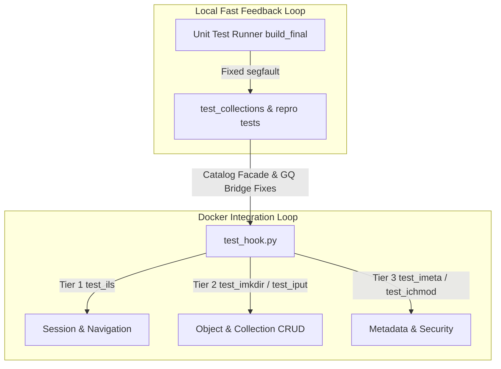

# iRODS L3KVG Plugin iCommand Qualification Implementation Plan

> **For agentic workers:** REQUIRED SUB-SKILL: Use superpowers:subagent-driven-development to implement this plan task-by-task. Steps use checkbox (`- [ ]`) syntax for tracking.

**Goal:** Resolve baseline unit test segfaults and achieve 100% pass rates across Tier 1, Tier 2, and Tier 3 iRODS icommand integration test suites in Docker.

**Architecture:** A dual-layer qualification workflow: run Docker-based icommand test suites (`test_hook.py`) to discover failure modes, isolate root causes via fast standalone C++ repro tests in `tests/`, apply fixes in `src/catalog/catalog_facade.cpp`, `src/gq1_bridge.cpp`, and `src/db_plugin.cpp`, and re-verify in Docker.

**Architecture Diagram:**



**Tech Stack:** C++, iRODS Database Plugin API, L3KVG Graph DB Engine, Docker (`irods_testing_environment`), Python 3 test runners.

## Global Constraints
- Standard iRODS API contracts and L3KVG graph schemas must be strictly preserved.
- All C++ unit test executables in `build_final/` must pass without crashing.
- No modifications to third-party or iRODS core server code outside `irods_database_plugin_l3kvg`.

---

### Task 1: Fix C++ Unit Test Suite Executables (Resolve `test_collections` Segfault)

**Files:**
- Modify: [test_collections.cpp](file:///home/darkfell/dev/irods_database_plugin_l3kvg/tests/test_collections.cpp#L1-L100)
- Modify: [catalog_facade.cpp](file:///home/darkfell/dev/irods_database_plugin_l3kvg/src/catalog/catalog_facade.cpp#L1-L100)
- Test: `build_final/test_collections`

**Interfaces:**
- Consumes: Mock L3KVG graph server and `catalog_facade` collection API.
- Produces: Clean passing `test_collections` binary without segfault.

- [ ] **Step 1: Run `test_collections` under gdb to pinpoint segfault location**

Run:
```bash
gdb -batch -ex "run" -ex "bt" ./test_collections
```
Cwd: `/home/darkfell/dev/irods_database_plugin_l3kvg/build_final`  
Expected: Stack trace identifying the exact line in `test_collections.cpp` or `catalog_facade.cpp` triggering the crash.

- [ ] **Step 2: Inspect code surrounding the crash line**

Read the target source file lines reported in the stack trace.

- [ ] **Step 3: Implement fix for null-pointer or unhandled mock response**

Apply targeted edit to `test_collections.cpp` or `catalog_facade.cpp`.

- [ ] **Step 4: Re-compile and verify `test_collections` passes**

Run:
```bash
make test_collections && ./test_collections
```
Cwd: `/home/darkfell/dev/irods_database_plugin_l3kvg/build_final`  
Expected: `[  PASSED  ] 2 tests.`

---

### Task 2: Tier 1 Qualification — Session & Base Directory Navigation (`test_ils`, `test_icd`, `test_ipwd`)

**Files:**
- Modify: [gq1_bridge.cpp](file:///home/darkfell/dev/irods_database_plugin_l3kvg/src/gq1_bridge.cpp#L200-L290)
- Modify: [catalog_facade.cpp](file:///home/darkfell/dev/irods_database_plugin_l3kvg/src/catalog/catalog_facade.cpp#L1-L200)
- Test: Docker container integration suite `test_ils`

**Interfaces:**
- Consumes: GenQuery1 AST and catalog facade collection/ACL projections.
- Produces: Correct handling of `COL_COLL_PARENT_NAME` query starting nodes and ACL ordering bitmask stripping.

- [ ] **Step 1: Execute `test_ils` suite in Docker container**

Run:
```bash
python3 test_hook.py --test test_ils
```
Cwd: `/home/darkfell/dev/irods_database_plugin_l3kvg`  
Expected: Execution log detailing test results for `ils`, `ils -l`, and `ils -A`.

- [ ] **Step 2: Triage any failing tests in `test_output.log`**

Inspect `/var/lib/irods/log/test_output.log` or copied log output to identify failing assertions.

- [ ] **Step 3: Apply fixes in `gq1_bridge.cpp` or `catalog_facade.cpp`**

Ensure `pure_inx = inx & ~ORDER_BY & ~ORDER_BY_DESC` is applied across all projections loops and parent child node resolution is handled cleanly.

- [ ] **Step 4: Re-run `test_ils` and verify clean pass**

Run:
```bash
python3 test_hook.py --test test_ils
```
Cwd: `/home/darkfell/dev/irods_database_plugin_l3kvg`  
Expected: `test_ils` passes all test cases cleanly.

---

### Task 3: Tier 2 Qualification — Data Object & Collection CRUD (`test_imkdir`, `test_iput`, `test_iget`, `test_irm`, `test_icp`)

**Files:**
- Modify: [db_plugin.cpp](file:///home/darkfell/dev/irods_database_plugin_l3kvg/src/db_plugin.cpp#L1-L300)
- Modify: [catalog_facade.cpp](file:///home/darkfell/dev/irods_database_plugin_l3kvg/src/catalog/catalog_facade.cpp#L200-L500)
- Test: Docker container integration suites `test_imkdir`, `test_iput`, `test_icp`

**Interfaces:**
- Consumes: iRODS DB Plugin operations for data/collection registration, authorization, and timestamps.
- Produces: Successful directory creation for standard users (`imkdir`), data object copy (`icp`), and modification timestamp accuracy (`Replica.mt`).

- [ ] **Step 1: Run `test_imkdir` in Docker**

Run:
```bash
python3 test_hook.py --test test_imkdir
```
Cwd: `/home/darkfell/dev/irods_database_plugin_l3kvg`  
Expected: Identification of permission verification behavior for standard users vs admin users.

- [ ] **Step 2: Fix standard user collection creation permission check**

Modify path permission evaluation in `catalog_facade.cpp` to correctly check parent collection ACL inheritance for standard users instead of defaulting to `SYS_NO_API_PRIV`.

- [ ] **Step 3: Run `test_iput` and `test_icp` in Docker**

Run:
```bash
python3 test_hook.py --test test_iput
```
Expected: Verify `iput` and `icp` upload and copy functionality.

- [ ] **Step 4: Re-run Tier 2 integration tests and confirm zero failures**

---

### Task 4: Tier 3 Qualification & Final Verification — Metadata & ACL Management (`test_imeta`, `test_ichmod`)

**Files:**
- Modify: [gq2_compiler.cpp](file:///home/darkfell/dev/irods_database_plugin_l3kvg/src/compiler/gq2_compiler.cpp#L1-L150)
- Modify: [catalog_facade.cpp](file:///home/darkfell/dev/irods_database_plugin_l3kvg/src/catalog/catalog_facade.cpp#L500-L700)
- Test: Docker container integration suites `test_imeta`, `test_ichmod`

**Interfaces:**
- Consumes: iRODS AVU management and ACL permission string mappings.
- Produces: Correct metadata query compilation and permission bitmask operations.

- [ ] **Step 1: Run `test_imeta` and `test_ichmod` in Docker**

Run:
```bash
python3 test_hook.py --test test_imeta
```
Cwd: `/home/darkfell/dev/irods_database_plugin_l3kvg`  

- [ ] **Step 2: Apply necessary fixes for AVU mapping and ACL level parsing**

- [ ] **Step 3: Perform final complete regression run across unit tests and Docker integration suites**

Run:
```bash
for f in ./test_*; do [ -x "$f" ] && [ ! -d "$f" ] && "$f"; done
```
Cwd: `/home/darkfell/dev/irods_database_plugin_l3kvg/build_final`  
Expected: All unit tests pass cleanly without errors.
