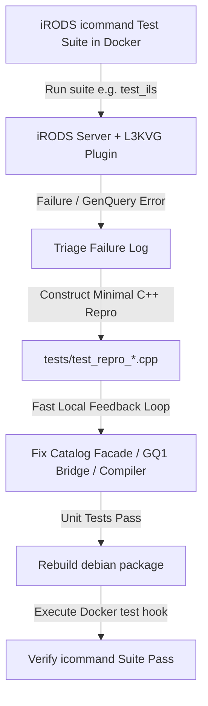

# Specification: Tiered iCommand Qualification & Micro-Repro Testing for iRODS L3KVG Plugin

**Date:** 2026-07-22  
**Status:** Approved  
**Target Component:** iRODS L3KVG Database Plugin (`irods_database_plugin_l3kvg`)  

---

## 1. Executive Summary

This specification outlines the strategy and scope for thoroughly qualifying the iRODS L3KVG database catalog plugin against standard iRODS `icommands`. Testing is structured into dependency-ordered qualification tiers executed in Docker containers, supported by standalone C++ repro test cases in `tests/` for rapid local bug isolation and remediation.

---

## 2. Architecture & Workflow

### 2.1 Dual-Level Testing Cycle

1. **Macro Layer (Docker Container Integration)**: Run standard iRODS Python test suites (`test_ils`, `test_iput`, `test_imkdir`, etc.) inside the `irods_testing_environment` container using `test_hook.py`.
2. **Micro Layer (C++ Repro Unit Tests)**: When an `icommand` fails inside Docker, isolate the failing GenQuery AST or Catalog Facade invocation and write a standalone test in `tests/test_repro_<feature>.cpp` to reproduce, debug, and fix the issue locally in seconds.

---

## 3. Categorized Qualification Tiers

### Tier 1: Base Navigation & Session Operations
- **Target Suites:** `test_ils`, `test_icd`, `test_ipwd`
- **Key Objectives:**
  - Verify directory listing (`ils`, `ils -l`, `ils -A`).
  - Resolve collection parent lookups (`COL_COLL_PARENT_NAME`) using parent node `CONTAINS` edges.
  - Correct single-quote SQL unescaping (`''` -> `'`) in conditions.
  - Fix `ils -A` collection ACL printing by stripping `ORDER_BY` and `ORDER_BY_DESC` bitwise flags in `gq1_bridge.cpp`.

### Tier 2: Data Object & Collection CRUD Operations
- **Target Suites:** `test_iput`, `test_iget`, `test_icp`, `test_irm`, `test_imkdir`, `test_itouch`
- **Key Objectives:**
  - Ensure data object creation, upload (`iput`), download (`iget`), and copy (`icp`).
  - Resolve non-admin collection creation permissions (`imkdir` returning `SYS_NO_API_PRIV`).
  - Validate replica modification timestamp (`Replica.mt` / `COL_D_MODIFY_TIME`).
  - Fix unit test suite failures in standalone C++ executables (resolve segfault in `test_collections`).

### Tier 3: Metadata & Access Control Management
- **Target Suites:** `test_imeta`, `test_ichmod`, `test_iadmin`
- **Key Objectives:**
  - Verify AVU (Attribute-Value-Unit) attachment, listing, and querying on objects and collections.
  - Validate ACL modifications (`ichmod`) and mapping between string permission levels (`read`, `write`, `own`) and internal integer masks.
  - Validate admin operations (`mkuser`, `moduser`, `mkresc`).

---

## 4. Quality & Success Criteria

1. **Unit Test Pass Rate**: 100% pass across all C++ unit test executables in `build_final/` (including fixing existing segfaults).
2. **Integration Test Pass Rate**: 100% pass across Tier 1 (`test_ils`) and Tier 2 (`test_iput`, `test_imkdir`, `test_irm`, `test_icp`) suite runs in the Docker container environment.
3. **No Unhandled Panics**: Zero server crashes, memory leaks, or unhandled graph engine panics in `irodsServer` or `catalog_facade`.

---

## 5. Non-Goals
- Modifying core iRODS server source code (work is strictly scoped to `irods_database_plugin_l3kvg`).
- Performance benchmarking beyond standard query execution correctness.
