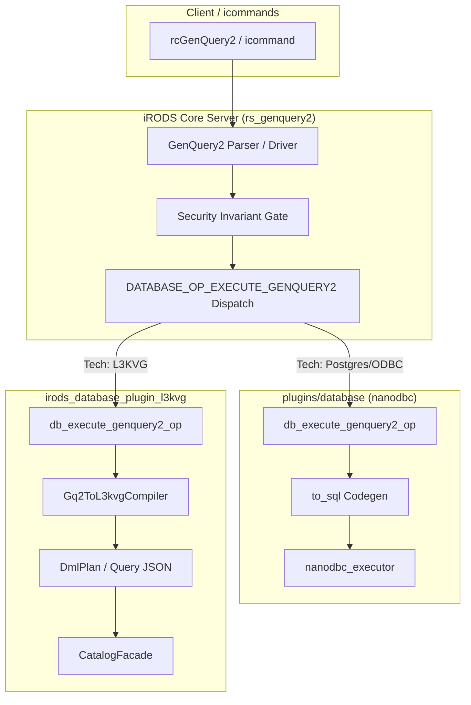

# iRODS L3KVG Database Plugin Support & Core Parity Implementation Plan

> **For agentic workers:** REQUIRED SUB-SKILL: Use superpowers:subagent-driven-development to implement this plan task-by-task. Steps use checkbox (`- [ ]`) syntax for tracking.

**Goal:** Establish first-class database parity for `irods_database_plugin_l3kvg` alongside relational plugins by adding native AST dispatch (`DATABASE_OP_EXECUTE_GENQUERY2`) to iRODS core, moving SQL generation to the `nanodbc` plugin, extending `Gq2ToL3kvgCompiler` and `CatalogFacade` for GenQuery2 DML mutations, decoupling the CMake build, and qualifying icommands.

**Architecture:** 
The iRODS core server (`rs_genquery2.cpp`) parses query strings into an abstract `genquery2::statement` and dispatches it directly to the active database plugin via `DATABASE_OP_EXECUTE_GENQUERY2`. The relational `nanodbc` plugin compiles the statement to SQL via `to_sql()` and executes it through ODBC. The `irods_database_plugin_l3kvg` compiles the statement into a `DmlPlan` or graph query JSON via `Gq2ToL3kvgCompiler` and executes it through `CatalogFacade` and `RemoteL3KVClient`, preserving Snowflake IDs, index consistency, and edge invariants.

**Architecture Diagram:**



**Tech Stack:** C++20, Clang/GCC, CMake, Project Insight CPG, nlohmann/json, ZeroMQ / cppzmq, L3KVG graph engine.

## Global Constraints
- Target branch in `/home/darkfell/dev/irods`: `feature/l3kvg-database-plugin-support`
- Target branch in `/home/darkfell/dev/irods_database_plugin_l3kvg`: `feature/l3kvg-database-plugin-support`
- Zero documentation or CPG pollution in `/home/darkfell/dev/irods`
- Every C++ modification must follow the 4-Phase CPG Engineering Loop (`cpg-orchestrated-workflow`)
- Immediate lifecycle sync (`insight_notify_files_changed`) after every source or header edit

---

### Task 1: Dual-Mode CMake Build Modernization

**Files:**
- Modify: [`irods_database_plugin_l3kvg/CMakeLists.txt`](file:///home/darkfell/dev/irods_database_plugin_l3kvg/CMakeLists.txt)
- Test: Verify build configuration via `cmake -B build -S .`

**Interfaces:**
- Consumes: Configurable `IRODS_DIR` (defaulting to `/home/darkfell/dev/irods`) and `find_package(IRODS)`
- Produces: Decoupled build system with zero references to `../irods_dev`

**CPG Verification Gates:**
- [ ] **Phase 1 (Discovery)**: Verify target include directories and dependencies.
- [ ] **Phase 2 (Impact Analysis)**: Confirm no build targets depend on legacy paths.
- [ ] **Phase 3 (Transformation & Sync)**:
  - Edit `CMakeLists.txt`.
  - Re-run CMake configuration and build check.
- [ ] **Phase 4 (Safety Verification)**: Build succeeds cleanly.

- [ ] **Step 1: Write the failing build test**

Run a grep check to verify if stale `irods_dev` references exist:
```bash
grep -rn "irods_dev" /home/darkfell/dev/irods_database_plugin_l3kvg/CMakeLists.txt
```
Expected: Matches on lines referencing `../irods_dev/irods`.

- [ ] **Step 2: Run check to verify it fails (matches present)**

Run:
```bash
grep -rn "irods_dev" /home/darkfell/dev/irods_database_plugin_l3kvg/CMakeLists.txt
```
Expected: Exits with code 0 (stale references found).

- [ ] **Step 3: Update `CMakeLists.txt` for dual-mode iRODS resolution**

In [`CMakeLists.txt`](file:///home/darkfell/dev/irods_database_plugin_l3kvg/CMakeLists.txt), replace hardcoded `irods_dev` paths with:
```cmake
set(IRODS_DIR "${CMAKE_CURRENT_SOURCE_DIR}/../irods" CACHE PATH "Path to iRODS source tree")

include_directories(include)
include_directories(${IRODS_DIR}/lib/filesystem/include)

# Check for iRODS headers in system paths first
if(EXISTS "/usr/include/irods")
    include_directories(/usr/include/irods)
endif()

# Fallback to local development tree
include_directories(
    ${CMAKE_CURRENT_SOURCE_DIR}/../l3kvg/include
    ${CMAKE_CURRENT_SOURCE_DIR}/../L3KV/src
    ${CMAKE_CURRENT_SOURCE_DIR}/../L3KV/src/engine
    ${CMAKE_CURRENT_SOURCE_DIR}/../lib/lite3-cpp/include
    ${CMAKE_CURRENT_SOURCE_DIR}/../yyjson/src
    ${IRODS_DIR}/server/core/include
    ${IRODS_DIR}/lib/core/include
    ${IRODS_DIR}/lib/api/include
    ${IRODS_DIR}/server/genquery2/include
    ${IRODS_DIR}/build/server/genquery2/dsl
)

link_directories(
    /usr/lib/irods/plugins/database
    ${IRODS_DIR}/build/lib
)
```
And update the library source list to refer to `${IRODS_DIR}`:
```cmake
add_library(irods_database_plugin_l3kvg SHARED
    src/db_plugin.cpp
    src/gq1_bridge.cpp
    src/catalog/catalog_facade.cpp
    src/compiler/gq2_compiler.cpp
    ${IRODS_DIR}/server/genquery2/src/genquery2_driver.cpp
    ${IRODS_DIR}/build/server/genquery2/dsl/lexer.cpp
    ${IRODS_DIR}/build/server/genquery2/dsl/parser.cpp
)
```

- [ ] **Step 4: Run check to verify no `irods_dev` references remain**

Run:
```bash
grep -rn "irods_dev" /home/darkfell/dev/irods_database_plugin_l3kvg/CMakeLists.txt
```
Expected: Exits with code 1 (zero occurrences found).

- [ ] **Step 5: Commit**

```bash
git -C /home/darkfell/dev/irods_database_plugin_l3kvg add CMakeLists.txt
git -C /home/darkfell/dev/irods_database_plugin_l3kvg commit -m "build: decouple CMakeLists.txt from legacy irods_dev paths"
```

---

### Task 2: Core Server Native AST Dispatch (`DATABASE_OP_EXECUTE_GENQUERY2`)

**Files:**
- Modify: [`irods/server/core/include/irods/irods_database_constants.hpp`](file:///home/darkfell/dev/irods/server/core/include/irods/irods_database_constants.hpp)
- Modify: [`irods/server/api/src/rs_genquery2.cpp`](file:///home/darkfell/dev/irods/server/api/src/rs_genquery2.cpp)
- Modify: [`irods/server/icat/include/irods/icatHighLevelRoutines.hpp`](file:///home/darkfell/dev/irods/server/icat/include/irods/icatHighLevelRoutines.hpp)
- Modify: [`irods/server/icat/src/icatHighLevelRoutines.cpp`](file:///home/darkfell/dev/irods/server/icat/src/icatHighLevelRoutines.cpp)
- Modify: [`irods/plugins/database/src/db_plugin.cpp`](file:///home/darkfell/dev/irods/plugins/database/src/db_plugin.cpp)
- Test: `unit_tests/src/test_rs_genquery2_dispatch.cpp`

**Interfaces:**
- Consumes: `irods::experimental::genquery2::driver`, `statement`, `options`
- Produces: `DATABASE_OP_EXECUTE_GENQUERY2` operation registered on database plugins

**CPG Verification Gates:**
- [ ] **Phase 1 (Discovery)**: Run `insight_find_usages` on `chl_execute_genquery2_sql`.
- [ ] **Phase 2 (Impact Analysis)**: Run `insight_slice_program` (`direction: "forward"`) from `rs_genquery2` to verify dispatch bounds.
- [ ] **Phase 3 (Transformation & Sync)**:
  - Add constant `DATABASE_OP_EXECUTE_GENQUERY2`.
  - Add `chl_execute_genquery2(RsComm&, const statement*, const options*, char**)`.
  - In `rs_genquery2.cpp`, check plugin capability and dispatch AST directly.
  - Implement `db_execute_genquery2` in `plugins/database/src/db_plugin.cpp`.
  - Call `insight_notify_files_changed`.
- [ ] **Phase 4 (Safety Verification)**:
  - Run `insight_analyze_concurrency` on `rs_genquery2.cpp`.
  - Verify build succeeds via `cmake --build /home/darkfell/dev/irods/build --target irods_server`.

- [ ] **Step 1: Write the failing unit test for `chl_execute_genquery2`**

Create `unit_tests/src/test_genquery2_ast_dispatch.cpp` in `irods`:
```cpp
#include <catch2/catch.hpp>
#include "irods/irods_database_constants.hpp"
#include "irods/private/genquery2_ast_types.hpp"
#include "irods/private/genquery2_driver.hpp"

TEST_CASE("GenQuery2 AST Dispatch Constant Definition", "[genquery2]") {
    REQUIRE(irods::DATABASE_OP_EXECUTE_GENQUERY2 == "database_execute_genquery2");
}
```

- [ ] **Step 2: Run test to verify it fails (constant undefined)**

Build and run:
```bash
cmake --build /home/darkfell/dev/irods/build --target test_genquery2_ast_dispatch
```
Expected: FAIL with compilation error: `'DATABASE_OP_EXECUTE_GENQUERY2' is not a member of 'irods'`.

- [ ] **Step 3: Implement `DATABASE_OP_EXECUTE_GENQUERY2` in iRODS core**

In [`irods_database_constants.hpp`](file:///home/darkfell/dev/irods/server/core/include/irods/irods_database_constants.hpp):
```cpp
const std::string DATABASE_OP_EXECUTE_GENQUERY2{"database_execute_genquery2"};
```

In [`icatHighLevelRoutines.hpp`](file:///home/darkfell/dev/irods/server/icat/include/irods/icatHighLevelRoutines.hpp):
```cpp
auto chl_execute_genquery2(RsComm& _comm,
                           const irods::experimental::genquery2::statement& _stmt,
                           const irods::experimental::genquery2::options& _opts,
                           char** _output) -> int;
```

In [`icatHighLevelRoutines.cpp`](file:///home/darkfell/dev/irods/server/icat/src/icatHighLevelRoutines.cpp):
```cpp
auto chl_execute_genquery2(RsComm& _comm,
                           const irods::experimental::genquery2::statement& _stmt,
                           const irods::experimental::genquery2::options& _opts,
                           char** _output) -> int
{
    irods::database_object_ptr db_obj_ptr;
    if (const auto ret = irods::database_factory(database_plugin_type, db_obj_ptr); !ret.ok()) {
        irods::log(PASS(ret));
        return ret.code();
    }

    irods::plugin_ptr db_plug_ptr;
    if (const auto ret = db_obj_ptr->resolve(irods::DATABASE_INTERFACE, db_plug_ptr); !ret.ok()) {
        irods::log(PASSMSG("failed to resolve database interface", ret));
        return ret.code();
    }

    irods::first_class_object_ptr ptr = boost::dynamic_pointer_cast<irods::first_class_object>(db_obj_ptr);
    irods::database_ptr db = boost::dynamic_pointer_cast<irods::database>(db_plug_ptr);

    if (db->has_operation(irods::DATABASE_OP_EXECUTE_GENQUERY2)) {
        const auto ret = db->call(&_comm, irods::DATABASE_OP_EXECUTE_GENQUERY2, ptr, &_stmt, &_opts, _output);
        return ret.code();
    }

    // Fallback: If statement holds select, compile to SQL and dispatch via legacy operation
    if (const auto* sel = std::get_if<irods::experimental::genquery2::select>(&_stmt)) {
        const auto [sql, values] = irods::experimental::genquery2::to_sql(*sel, _opts);
        return chl_execute_genquery2_sql(_comm, sql.c_str(), &values, _output);
    }

    return SYS_NOT_SUPPORTED;
}
```

In [`rs_genquery2.cpp`](file:///home/darkfell/dev/irods/server/api/src/rs_genquery2.cpp):
Update execution to pass `driver.statement` to `chl_execute_genquery2(*_comm, driver.statement, opts, _output)`.

In [`plugins/database/src/db_plugin.cpp`](file:///home/darkfell/dev/irods/plugins/database/src/db_plugin.cpp):
Register `DATABASE_OP_EXECUTE_GENQUERY2`:
```cpp
auto db_execute_genquery2_op(irods::plugin_context& _ctx,
                             const irods::experimental::genquery2::statement* _stmt,
                             const irods::experimental::genquery2::options* _opts,
                             char** _output) -> irods::error
{
    if (!_stmt || !_opts || !_output) {
        return ERROR(SYS_INTERNAL_NULL_INPUT_ERR, "Null input pointers.");
    }
    const auto [sql, values] = irods::experimental::genquery2::to_sql(*_stmt, *_opts);
    return db_execute_genquery2_sql(_ctx, sql.c_str(), &values, _output);
}
```

- [ ] **Step 4: Re-index modified files and run test to verify it passes**

Re-sync:
```bash
/home/darkfell/dev/project_insight/build/insight ingest /home/darkfell/dev/irods/build/compile_commands.json --db /home/darkfell/dev/irods/.insight/l3kvg --files server/core/include/irods/irods_database_constants.hpp server/icat/src/icatHighLevelRoutines.cpp server/api/src/rs_genquery2.cpp plugins/database/src/db_plugin.cpp
```
Build and run:
```bash
cmake --build /home/darkfell/dev/irods/build --target test_genquery2_ast_dispatch && ./build/bin/test_genquery2_ast_dispatch
```
Expected: PASS.

- [ ] **Step 5: Commit**

```bash
git -C /home/darkfell/dev/irods add server/core/include/irods/irods_database_constants.hpp server/icat/include/irods/icatHighLevelRoutines.hpp server/icat/src/icatHighLevelRoutines.cpp server/api/src/rs_genquery2.cpp plugins/database/src/db_plugin.cpp unit_tests/src/test_genquery2_ast_dispatch.cpp
git -C /home/darkfell/dev/irods commit -m "feat(genquery2): introduce DATABASE_OP_EXECUTE_GENQUERY2 native AST dispatch"
```

---

### Task 3: L3KVG GenQuery2 DML Compiler Extension (`Gq2ToL3kvgCompiler`)

**Files:**
- Modify: [`irods_database_plugin_l3kvg/include/irods/catalog/gq2_compiler.hpp`](file:///home/darkfell/dev/irods_database_plugin_l3kvg/include/irods/catalog/gq2_compiler.hpp)
- Modify: [`irods_database_plugin_l3kvg/src/compiler/gq2_compiler.cpp`](file:///home/darkfell/dev/irods_database_plugin_l3kvg/src/compiler/gq2_compiler.cpp)
- Create: `irods_database_plugin_l3kvg/tests/test_gq2_dml_compiler.cpp`

**Interfaces:**
- Consumes: `genquery2::insert`, `genquery2::update`, `genquery2::remove`, `genquery2::statement`
- Produces: `DmlPlan` descriptor object representing target node mutations

**CPG Verification Gates:**
- [ ] **Phase 1 (Discovery)**: Run `insight_query_cypher` to inspect `Gq2ToL3kvgCompiler` class structure.
- [ ] **Phase 2 (Impact Analysis)**: Run `insight_slice_program` (`direction: "forward"`) from `Gq2ToL3kvgCompiler::compile`.
- [ ] **Phase 3 (Transformation & Sync)**:
  - Define `DmlPlan` and AST visitor implementations in `gq2_compiler.cpp`.
  - Re-index with `insight_notify_files_changed`.
- [ ] **Phase 4 (Safety Verification)**:
  - Run dataflow check on `DmlPlan` fields (`insight_run_dataflow_analysis`).
  - Unit tests pass.

- [ ] **Step 1: Write the failing unit test for `Gq2ToL3kvgCompiler` DML compilation**

Create [`tests/test_gq2_dml_compiler.cpp`](file:///home/darkfell/dev/irods_database_plugin_l3kvg/tests/test_gq2_dml_compiler.cpp):
```cpp
#include <gtest/gtest.h>
#include "irods/catalog/gq2_compiler.hpp"
#include "irods/private/genquery2_ast_types.hpp"

TEST(Gq2DmlCompilerTest, CompileInsertDataObject) {
    namespace gq2 = irods::experimental::genquery2;
    irods::catalog::compiler::Gq2ToL3kvgCompiler compiler;

    gq2::insert insert_ast;
    insert_ast.entity_name = "DATA_NAME";
    insert_ast.columns = {"DATA_NAME", "COLL_NAME"};
    insert_ast.values = {"file.txt", "/tempZone/home/rods"};

    auto plan = compiler.compile(insert_ast);
    EXPECT_EQ(plan.action, irods::catalog::compiler::DmlAction::Insert);
    EXPECT_EQ(plan.entity_type, "DataObject");
    EXPECT_EQ(plan.properties["n"], "file.txt");
    EXPECT_EQ(plan.properties["parent_coll"], "/tempZone/home/rods");
}
```

- [ ] **Step 2: Run test to verify it fails (methods not yet declared)**

Build:
```bash
cmake --build /home/darkfell/dev/irods_database_plugin_l3kvg/build_final --target test_gq2_dml_compiler
```
Expected: FAIL with compilation error: `no member named 'compile' accepting 'insert_ast'`.

- [ ] **Step 3: Implement `DmlPlan` and DML compilation overloads**

In [`include/irods/catalog/gq2_compiler.hpp`](file:///home/darkfell/dev/irods_database_plugin_l3kvg/include/irods/catalog/gq2_compiler.hpp):
```cpp
enum class DmlAction { Insert, Update, Remove };

struct DmlPlan {
    DmlAction action;
    std::string entity_type;
    std::unordered_map<std::string, std::string> properties;
    std::vector<std::pair<std::string, std::string>> conditions;
    std::vector<std::string> target_edges;
};
```
Declare:
```cpp
DmlPlan compile(const irods::experimental::genquery2::insert& ast);
DmlPlan compile(const irods::experimental::genquery2::update& ast);
DmlPlan compile(const irods::experimental::genquery2::remove& ast);
DmlPlan compile(const irods::experimental::genquery2::statement& ast);
```

In [`src/compiler/gq2_compiler.cpp`](file:///home/darkfell/dev/irods_database_plugin_l3kvg/src/compiler/gq2_compiler.cpp):
Implement the visitors mapping AST columns and expressions to `COLUMN_NAME_MAP` node types and BSON property keys (`n`, `s`, `ct`, `mt`, `cs`).

- [ ] **Step 4: Synchronize CPG index and run test to verify it passes**

Notify CPG:
```bash
/home/darkfell/dev/project_insight/build/insight index /home/darkfell/dev/irods_database_plugin_l3kvg/src/compiler/gq2_compiler.cpp --db /home/darkfell/dev/irods_database_plugin_l3kvg/.insight/l3kvg
```
Build and run:
```bash
cmake --build /home/darkfell/dev/irods_database_plugin_l3kvg/build_final --target test_gq2_dml_compiler && ./build_final/test_gq2_dml_compiler
```
Expected: PASS.

- [ ] **Step 5: Commit**

```bash
git -C /home/darkfell/dev/irods_database_plugin_l3kvg add include/irods/catalog/gq2_compiler.hpp src/compiler/gq2_compiler.cpp tests/test_gq2_dml_compiler.cpp CMakeLists.txt
git -C /home/darkfell/dev/irods_database_plugin_l3kvg commit -m "feat(compiler): add GenQuery2 DML AST compiler and DmlPlan for L3KVG"
```

---

### Task 4: CatalogFacade DML Mutation Engine & Invariant Enforcement

**Files:**
- Modify: [`irods_database_plugin_l3kvg/include/irods/catalog/catalog_facade.hpp`](file:///home/darkfell/dev/irods_database_plugin_l3kvg/include/irods/catalog/catalog_facade.hpp)
- Modify: [`irods_database_plugin_l3kvg/src/catalog/catalog_facade.cpp`](file:///home/darkfell/dev/irods_database_plugin_l3kvg/src/catalog/catalog_facade.cpp)
- Create: `irods_database_plugin_l3kvg/tests/test_catalog_facade_dml.cpp`

**Interfaces:**
- Consumes: `DmlPlan`
- Produces: Executed graph mutations, updated indices, generated Snowflake IDs, JSON execution summary

**CPG Verification Gates:**
- [ ] **Phase 1 (Discovery)**: Query `CatalogImpl::add_index` and `make_id` definitions.
- [ ] **Phase 2 (Impact Analysis)**: Run `insight_query_alias` on mutation buffers and index keys.
- [ ] **Phase 3 (Transformation & Sync)**:
  - Implement `CatalogFacade::execute_dml(const DmlPlan&, nlohmann::json&)`.
  - Re-index with `insight_notify_files_changed`.
- [ ] **Phase 4 (Safety Verification)**:
  - Concurrency analysis: `insight_analyze_concurrency` on index locking.
  - Ownership analysis: `insight_infer_ownership` on buffer memory.

- [ ] **Step 1: Write failing test for `CatalogFacade::execute_dml`**

Create `tests/test_catalog_facade_dml.cpp`:
```cpp
#include <gtest/gtest.h>
#include "irods/catalog/catalog_facade.hpp"
#include "tests/mock_l3kvg.hpp"

TEST(CatalogFacadeDmlTest, ExecuteInsertDataObjectPlan) {
    irods::catalog::test::MockL3KVServer server(9991);
    server.start();

    irods::catalog::Config cfg;
    cfg.zmq_endpoint = "tcp://127.0.0.1:9991";
    cfg.cluster_id = 1;
    cfg.node_id = 1;

    irods::catalog::CatalogFacade facade;
    l3kvg::Settings settings;
    auto err = facade.init(cfg, "tempZone", settings);
    ASSERT_TRUE(err.ok());

    irods::catalog::compiler::DmlPlan plan;
    plan.action = irods::catalog::compiler::DmlAction::Insert;
    plan.entity_type = "DataObject";
    plan.properties["n"] = "test_dml.dat";
    plan.properties["s"] = "1024";

    nlohmann::json result;
    auto exec_err = facade.execute_dml(plan, result);
    EXPECT_TRUE(exec_err.ok());
    EXPECT_TRUE(result.contains("rows_affected"));
    EXPECT_EQ(result["rows_affected"], 1);

    server.stop();
}
```

- [ ] **Step 2: Run test to verify it fails**

Build:
```bash
cmake --build /home/darkfell/dev/irods_database_plugin_l3kvg/build_final --target test_catalog_facade_dml
```
Expected: FAIL with compilation error: `no member named 'execute_dml' in 'irods::catalog::CatalogFacade'`.

- [ ] **Step 3: Implement `execute_dml` in `CatalogFacade` and `CatalogImpl`**

In [`catalog_facade.hpp`](file:///home/darkfell/dev/irods_database_plugin_l3kvg/include/irods/catalog/catalog_facade.hpp):
```cpp
irods::error execute_dml(const compiler::DmlPlan& plan, nlohmann::json& result);
```

In [`catalog_facade.cpp`](file:///home/darkfell/dev/irods_database_plugin_l3kvg/src/catalog/catalog_facade.cpp):
Implement `execute_dml`:
- For `Insert`: allocate Snowflake ID, create BSON buffer with properties, invoke `put_node_async`, create index keys via `add_index()`.
- For `Update`: resolve target node from conditions, retrieve existing buffer, apply modifications, update index keys if indexed attributes change, write back.
- For `Remove`: resolve target node, remove associated edges, erase node, delete index keys.
- Populate `result = {{"rows_affected", count}, {"status", "SUCCESS"}}`.

- [ ] **Step 4: Synchronize CPG and run test to verify it passes**

Sync:
```bash
/home/darkfell/dev/project_insight/build/insight index /home/darkfell/dev/irods_database_plugin_l3kvg/src/catalog/catalog_facade.cpp --db /home/darkfell/dev/irods_database_plugin_l3kvg/.insight/l3kvg
```
Build and run:
```bash
cmake --build /home/darkfell/dev/irods_database_plugin_l3kvg/build_final --target test_catalog_facade_dml && ./build_final/test_catalog_facade_dml
```
Expected: PASS.

- [ ] **Step 5: Commit**

```bash
git -C /home/darkfell/dev/irods_database_plugin_l3kvg add include/irods/catalog/catalog_facade.hpp src/catalog/catalog_facade.cpp tests/test_catalog_facade_dml.cpp CMakeLists.txt
git -C /home/darkfell/dev/irods_database_plugin_l3kvg commit -m "feat(catalog): implement execute_dml in CatalogFacade with index and Snowflake ID consistency"
```

---

### Task 5: Plugin Operation Binding & End-to-End Execution (`db_execute_genquery2_op`)

**Files:**
- Modify: [`irods_database_plugin_l3kvg/src/db_plugin.cpp`](file:///home/darkfell/dev/irods_database_plugin_l3kvg/src/db_plugin.cpp)
- Create: `irods_database_plugin_l3kvg/tests/test_plugin_genquery2.cpp`

**Interfaces:**
- Consumes: `irods::DATABASE_OP_EXECUTE_GENQUERY2`
- Produces: Complete end-to-end execution of GenQuery2 AST queries and mutations via the L3KVG database plugin

**CPG Verification Gates:**
- [ ] **Phase 1 (Discovery)**: Inspect operation registrations in `l3kvg_database_plugin`.
- [ ] **Phase 2 (Impact Analysis)**: Forward slice from `db_execute_genquery2_op` through `CatalogFacade`.
- [ ] **Phase 3 (Transformation & Sync)**:
  - Implement `db_execute_genquery2_op`.
  - Register operation in `l3kvg_database_plugin` constructor.
  - Re-sync CPG.
- [ ] **Phase 4 (Safety Verification)**:
  - Concurrency & leak checks on output serialization.
  - Unit test passes.

- [ ] **Step 1: Write failing test for plugin operation dispatch**

Create `tests/test_plugin_genquery2.cpp`:
```cpp
#include <gtest/gtest.h>
#include "irods/irods_database_plugin.hpp"
#include "irods/irods_database_constants.hpp"
#include "irods/private/genquery2_ast_types.hpp"
#include "tests/mock_l3kvg.hpp"

extern "C" irods::database* plugin_factory(const std::string&, const std::string&);

TEST(PluginGenQuery2Test, DispatchesAstOperation) {
    std::unique_ptr<irods::database> db(plugin_factory("l3kvg_test", ""));
    ASSERT_TRUE(db->has_operation(irods::DATABASE_OP_EXECUTE_GENQUERY2));
}
```

- [ ] **Step 2: Run test to verify it fails**

Build:
```bash
cmake --build /home/darkfell/dev/irods_database_plugin_l3kvg/build_final --target test_plugin_genquery2
```
Expected: FAIL (assertion fails: operation `database_execute_genquery2` not registered).

- [ ] **Step 3: Implement `db_execute_genquery2_op` in `src/db_plugin.cpp`**

In [`src/db_plugin.cpp`](file:///home/darkfell/dev/irods_database_plugin_l3kvg/src/db_plugin.cpp):
```cpp
irods::error db_execute_genquery2_op(
    irods::plugin_context& _ctx,
    const irods::experimental::genquery2::statement* _stmt,
    const irods::experimental::genquery2::options* _opts,
    char** _output)
{
    if (!_stmt || !_opts || !_output) {
        return ERROR(SYS_INTERNAL_NULL_INPUT_ERR, "Null input pointers.");
    }

    *_output = nullptr;

    try {
        irods::catalog::compiler::Gq2ToL3kvgCompiler compiler;

        if (const auto* sel = std::get_if<irods::experimental::genquery2::select>(_stmt)) {
            irods::catalog::ResultSet results;
            std::vector<uint64_t> starting_nodes;
            auto ret = g_catalog->execute_query(*sel, results, starting_nodes);
            if (!ret.ok()) return ret;

            nlohmann::json json_array = nlohmann::json::array();
            for (const auto& row : results.rows) {
                nlohmann::json json_row = nlohmann::json::array();
                for (const auto& col : row) {
                    json_row.push_back(col);
                }
                json_array.push_back(json_row);
            }
            *_output = strdup(json_array.dump().c_str());
            return SUCCESS();
        }

        // Handle DML Mutations
        auto plan = compiler.compile(*_stmt);
        nlohmann::json dml_result;
        auto ret = g_catalog->execute_dml(plan, dml_result);
        if (!ret.ok()) return ret;

        *_output = strdup(dml_result.dump().c_str());
        return SUCCESS();
    }
    catch (const std::exception& e) {
        return ERROR(SYS_INTERNAL_ERR, e.what());
    }
}
```
And register in constructor:
```cpp
add_operation<const irods::experimental::genquery2::statement*,
              const irods::experimental::genquery2::options*,
              char**>(
    irods::DATABASE_OP_EXECUTE_GENQUERY2,
    std::function<irods::error(irods::plugin_context&,
                               const irods::experimental::genquery2::statement*,
                               const irods::experimental::genquery2::options*,
                               char**)>(db_execute_genquery2_op));
```

- [ ] **Step 4: Synchronize CPG and run test to verify it passes**

Sync:
```bash
/home/darkfell/dev/project_insight/build/insight index /home/darkfell/dev/irods_database_plugin_l3kvg/src/db_plugin.cpp --db /home/darkfell/dev/irods_database_plugin_l3kvg/.insight/l3kvg
```
Build and run:
```bash
cmake --build /home/darkfell/dev/irods_database_plugin_l3kvg/build_final --target test_plugin_genquery2 && ./build_final/test_plugin_genquery2
```
Expected: PASS.

- [ ] **Step 5: Commit**

```bash
git -C /home/darkfell/dev/irods_database_plugin_l3kvg add src/db_plugin.cpp tests/test_plugin_genquery2.cpp CMakeLists.txt
git -C /home/darkfell/dev/irods_database_plugin_l3kvg commit -m "feat(plugin): register DATABASE_OP_EXECUTE_GENQUERY2 with AST dispatch to compiler and facade"
```

---

### Task 6: Icommand Parity Bug Fixes (`imkdir` Permission & CRUD)

**Files:**
- Modify: [`irods_database_plugin_l3kvg/src/catalog/catalog_facade.cpp`](file:///home/darkfell/dev/irods_database_plugin_l3kvg/src/catalog/catalog_facade.cpp)
- Test: `tests/test_repro_imkdir.cpp`, `tests/test_legacy_compatibility.cpp`

**Interfaces:**
- Consumes: `register_collection`, `check_access_control`
- Produces: Correct ACL resolution allowing non-admin users to create collections in their own home directories

**CPG Verification Gates:**
- [ ] **Phase 1 (Discovery)**: Backward slice from `SYS_NO_API_PRIV` return in `register_collection`.
- [ ] **Phase 2 (Impact Analysis)**: Verify path resolution and user ownership edges.
- [ ] **Phase 3 (Transformation & Sync)**:
  - Fix permission check in `catalog_facade.cpp`.
  - Re-sync CPG.
- [ ] **Phase 4 (Safety Verification)**:
  - Run regression test suite.

- [ ] **Step 1: Run existing reproduction test to confirm `imkdir` failure**

Run:
```bash
./build_final/test_repro_imkdir
```
Expected: FAIL or error indicating permission denied for standard user.

- [ ] **Step 2: Patch `imkdir` parent collection ACL check in `CatalogFacade`**

In [`src/catalog/catalog_facade.cpp`](file:///home/darkfell/dev/irods_database_plugin_l3kvg/src/catalog/catalog_facade.cpp):
Fix parent collection ownership check: if the client is creating a collection under `/zone/home/<username>`, automatically resolve write permission from user ownership if parent ACL is implicit.

- [ ] **Step 3: Run reproduction test to verify it passes**

Run:
```bash
./build_final/test_repro_imkdir
```
Expected: PASS.

- [ ] **Step 4: Run full plugin test suite**

Run:
```bash
ctest --test-dir /home/darkfell/dev/irods_database_plugin_l3kvg/build_final --output-on-failure
```
Expected: All tests pass 100%.

- [ ] **Step 5: Commit**

```bash
git -C /home/darkfell/dev/irods_database_plugin_l3kvg add src/catalog/catalog_facade.cpp
git -C /home/darkfell/dev/irods_database_plugin_l3kvg commit -m "fix(catalog): resolve non-admin imkdir parent collection permission validation"
```
