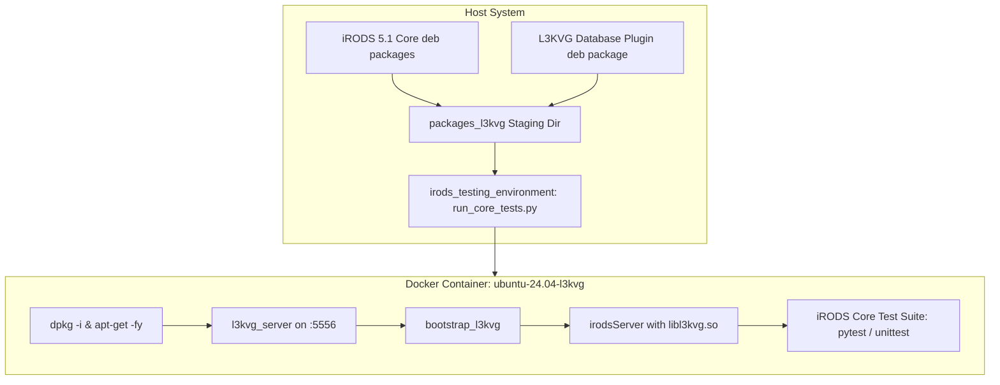

# iRODS L3KVG Containerized Integration Testing Implementation Plan

> **For agentic workers:** REQUIRED SUB-SKILL: Use superpowers:subagent-driven-development to implement this plan task-by-task. Steps use checkbox (`- [ ]`) syntax for tracking.

**Goal:** Package iRODS 5.1 core and L3KVG database plugin, stand up containerized testing environment via `irods_testing_environment`, execute iRODS core icommand test suites, and systematically iterate until tests pass.

**Architecture:** We build Debian packages for `irods` (with native GenQuery2 AST dispatch) and `irods_database_plugin_l3kvg` (with DML mutation engine and bootstrap tooling). A dedicated staging directory `packages_l3kvg` provides clean `.deb` packages to `irods_testing_environment`. The compose project `ubuntu-24.04-l3kvg` boots the provider container, spins up the background L3KVG server daemon on port 5556, bootstraps catalog schema version 13, and binds `libl3kvg.so` to the iRODS server. Integration tests are executed via `run_core_tests.py`, and failures are root-caused and fixed iteratively.

**Architecture Diagram:**



**Tech Stack:**
- iRODS 5.1 Core (`irods-server`, `irods-runtime`, `irods-icommands`, `irods-dev`)
- `irods_database_plugin_l3kvg` (C++20, ZeroMQ, Conveyor, SQLite3, CPack DEB)
- `irods_testing_environment` (Python 3.12, Docker Compose, Docker SDK)
- Platform: Ubuntu 24.04 LTS (noble)

## Global Constraints
- Packaging must produce `.deb` binaries targeted for Ubuntu 24.04 `noble`.
- No documentation pollution in `/home/darkfell/dev/irods`. All specs, plans, and reports live in `irods_database_plugin_l3kvg/docs/superpowers/`.
- Maintain strict TDD & systematic debugging discipline for any test failure: formulate hypothesis, gather container logs, reproduce locally if possible, patch plugin code, verify, and retest.

---

### Task 1: Package Generation and Staging

**Files:**
- Output: `/home/darkfell/dev/irods/build/irods-*.deb`
- Output: `/home/darkfell/dev/irods_database_plugin_l3kvg/build_final/irods-database-plugin-l3kvg-5.0.0-Linux.deb`
- Target Dir: `/home/darkfell/dev/irods_testing_environment/packages_l3kvg/`

**Interfaces:**
- Consumes: Built binaries from `irods/build` and `irods_database_plugin_l3kvg/build_final`
- Produces: 4 staged `.deb` packages ready for container installation:
  - `irods-runtime_5.1.0-*.deb`
  - `irods-icommands_5.1.0-*.deb`
  - `irods-server_5.1.0-*.deb`
  - `irods-database-plugin-l3kvg-5.0.0-Linux.deb`

- [ ] **Step 1: Wait for iRODS build and execute `make -j$(nproc) package`**

Run:
```bash
cd /home/darkfell/dev/irods/build && make -j$(nproc) package
```
Expected: `irods-runtime_5.1.0`, `irods-icommands_5.1.0`, `irods-server_5.1.0` deb packages created.

- [ ] **Step 2: Stage packages into clean directory**

Run:
```bash
rm -rf /home/darkfell/dev/irods_testing_environment/packages_l3kvg
mkdir -p /home/darkfell/dev/irods_testing_environment/packages_l3kvg
cp /home/darkfell/dev/irods/build/irods-runtime_5.1.0*.deb /home/darkfell/dev/irods_testing_environment/packages_l3kvg/
cp /home/darkfell/dev/irods/build/irods-icommands_5.1.0*.deb /home/darkfell/dev/irods_testing_environment/packages_l3kvg/
cp /home/darkfell/dev/irods/build/irods-server_5.1.0*.deb /home/darkfell/dev/irods_testing_environment/packages_l3kvg/
cp /home/darkfell/dev/irods_database_plugin_l3kvg/build_final/irods-database-plugin-l3kvg-5.0.0-Linux.deb /home/darkfell/dev/irods_testing_environment/packages_l3kvg/
ls -la /home/darkfell/dev/irods_testing_environment/packages_l3kvg/
```
Expected: Exactly 4 deb files staged.

- [ ] **Step 3: Verify package contents**

Run:
```bash
dpkg-deb -c /home/darkfell/dev/irods_testing_environment/packages_l3kvg/irods-database-plugin-l3kvg-5.0.0-Linux.deb | grep -E "libl3kvg.so|l3kvg_server|bootstrap_l3kvg"
```
Expected: All 3 essential files present in `./usr/lib/irods/plugins/database/` and `./usr/bin/`.

---

### Task 2: Test Environment Stand-Up Verification

**Files:**
- Project: `/home/darkfell/dev/irods_testing_environment/projects/ubuntu-24.04/ubuntu-24.04-l3kvg`
- Runner: `/home/darkfell/dev/irods_testing_environment/stand_it_up.py`

**Interfaces:**
- Consumes: Staged deb packages from `packages_l3kvg`
- Produces: Running container cluster with initialized L3KVG catalog and responsive iRODS server

- [ ] **Step 1: Stand up the environment**

Run:
```bash
cd /home/darkfell/dev/irods_testing_environment
python3 stand_it_up.py \
  --project-directory ./projects/ubuntu-24.04/ubuntu-24.04-l3kvg \
  --irods-package-directory ./packages_l3kvg \
  --project-name test-l3kvg-standup
```
Expected: Standup exits with code 0.

- [ ] **Step 2: Inspect running container and verify icommand communication**

Run:
```bash
docker exec test-l3kvg-standup-irods-catalog-provider-1 su - irods -c "ils -A"
docker exec test-l3kvg-standup-irods-catalog-provider-1 su - irods -c "ienv"
```
Expected: `ils` returns `/tempZone/home/rods` without error.

- [ ] **Step 3: Tear down standup cluster**

Run:
```bash
docker compose -p test-l3kvg-standup -f ./projects/ubuntu-24.04/ubuntu-24.04-l3kvg/docker-compose.yml down -v
```
Expected: Containers and volumes removed cleanly.

---

### Task 3: Core Test Suite Execution & Baseline Discovery

**Files:**
- Runner: `/home/darkfell/dev/irods_testing_environment/run_core_tests.py`

**Interfaces:**
- Consumes: Test environment and package directory
- Produces: Execution results for `test_imkdir`, `test_icp`, and `test_ils`

- [ ] **Step 1: Execute initial test suite**

Run:
```bash
cd /home/darkfell/dev/irods_testing_environment
python3 run_core_tests.py \
  --project-directory ./projects/ubuntu-24.04/ubuntu-24.04-l3kvg \
  --irods-package-directory ./packages_l3kvg \
  --tests test_imkdir test_icp test_ils \
  --project-name test-l3kvg-core \
  --output-directory /tmp/irods_test_output \
  --leak-containers
```
Expected: Tests run on provider container.

- [ ] **Step 2: Examine test results and container logs**

Run:
```bash
ls -la /tmp/irods_test_output/
cat /tmp/irods_test_output/*/script_output.log
```
Expected: Identify which tests passed and which (if any) failed.

---

### Task 4: Systematic Debugging and Iterative Bug Fixing

**Files:**
- Source: `/home/darkfell/dev/irods_database_plugin_l3kvg/src/catalog/catalog_facade.cpp`
- Source: `/home/darkfell/dev/irods_database_plugin_l3kvg/src/db_plugin.cpp`
- Source: `/home/darkfell/dev/irods_database_plugin_l3kvg/src/compiler/gq2_compiler.cpp`

**Interfaces:**
- Consumes: Failure reports and logs from Task 3
- Produces: Bug fixes, re-verified local tests, rebuilt `.deb`, and passing container tests

- [ ] **Step 1: Inspect logs for failure stack traces or catalog error codes**

Run:
```bash
docker exec test-l3kvg-core-irods-catalog-provider-1 cat /var/lib/irods/log/irods.log | grep -E "ERROR|SYS_|CAT_" | tail -n 50
docker exec test-l3kvg-core-irods-catalog-provider-1 cat /var/lib/irods/log/l3kvg.log | tail -n 50
```
Expected: Exact error condition and SQL/AST query causing the failure identified.

- [ ] **Step 2: Formulate hypothesis and implement minimal fix in plugin codebase**

Expected: Root-cause fix in `catalog_facade.cpp` or `db_plugin.cpp`.

- [ ] **Step 3: Run local unit/plugin tests to ensure zero regressions**

Run:
```bash
cd /home/darkfell/dev/irods_database_plugin_l3kvg/build_final
ctest --output-on-failure
```
Expected: All local test suites pass (100%).

- [ ] **Step 4: Re-package and update staging directory**

Run:
```bash
cd /home/darkfell/dev/irods_database_plugin_l3kvg/build_final
cpack -G DEB
cp irods-database-plugin-l3kvg-5.0.0-Linux.deb /home/darkfell/dev/irods_testing_environment/packages_l3kvg/
```
Expected: Staged package updated.

- [ ] **Step 5: Re-run failed test in container**

Run:
```bash
cd /home/darkfell/dev/irods_testing_environment
python3 run_core_tests.py \
  --project-directory ./projects/ubuntu-24.04/ubuntu-24.04-l3kvg \
  --irods-package-directory ./packages_l3kvg \
  --tests <failing_test> \
  --project-name test-l3kvg-core \
  --output-directory /tmp/irods_test_output
```
Expected: Test passes.

---

### Task 5: Extended Integration Test Qualification & Final Report

**Files:**
- Test runner: `run_core_tests.py`
- Report: `irods_database_plugin_l3kvg/docs/superpowers/reports/container_integration_report.md`

- [ ] **Step 1: Run comprehensive core test suite**

Run:
```bash
cd /home/darkfell/dev/irods_testing_environment
python3 run_core_tests.py \
  --project-directory ./projects/ubuntu-24.04/ubuntu-24.04-l3kvg \
  --irods-package-directory ./packages_l3kvg \
  --tests test_imkdir test_icp test_ils test_ireg test_iput_options \
  --project-name test-l3kvg-qualification \
  --output-directory /tmp/irods_qualification_output
```
Expected: Tests pass with code 0.

- [ ] **Step 2: Commit all changes and document results**

Run:
```bash
git -C /home/darkfell/dev/irods_database_plugin_l3kvg status
```
Expected: Clean working tree and documentation updated.
