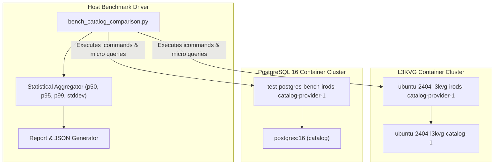

# iRODS L3KVG vs PostgreSQL 16 Performance Benchmark Implementation Plan

> **For agentic workers:** REQUIRED SUB-SKILL: Use superpowers:subagent-driven-development to implement this plan task-by-task. Steps use checkbox (`- [ ]`) syntax for tracking.

**Goal:** Implement an automated, reproducible comparative benchmarking harness and execute multi-tier scale sweeps (1K, 10K, and 50K objects) comparing the L3KVG graph catalog against PostgreSQL 16.

**Architecture:** A unified modular Python benchmark orchestrator ([`bench_catalog_comparison.py`](file:///home/darkfell/dev/bench_catalog_comparison.py)) controls both the running L3KVG container cluster and a parallel PostgreSQL 16 cluster stood up via [`stand_it_up.py`](file:///home/darkfell/dev/irods_testing_environment/stand_it_up.py). It executes identical macro-level icommand workloads and micro-level catalog queries, gathers high-resolution monotonic timestamps, computes statistical distributions (mean, p50, p95, p99), profiles database disk/memory footprints, and generates a structured JSON and markdown report.

**Architecture Diagram:**



**Tech Stack:** Python 3 (standard library, `subprocess`, `statistics`, `json`), Docker / Docker Compose, iRODS 5.1.0 icommands (`ils`, `iput`, `itouch`, `imkdir`, `imeta`, `iquest`, `irm`), PostgreSQL 16, L3KVG Graph Engine.

## Global Constraints
- All file creations must use zero-byte files (`itouch` or empty `iput`) to isolate catalog transaction latency from storage I/O.
- Test collections must be created in `/tempZone/home/rods/bench_<uuid>/` and cleanly destroyed after each tier.
- Exact package versions across both clusters: iRODS server, icommands, and runtime `5.1.0-0~noble_amd64`.
- PostgreSQL database plugin version: `irods-database-plugin-postgres_5.1.0-0~noble_amd64.deb`.
- Minimum 5 iterations per workload tier with statistical outlier filtering.

---

### Task 1: Environment Staging & PostgreSQL Cluster Stand-up

**Files:**
- Reference: [`/home/darkfell/dev/irods_testing_environment/stand_it_up.py`](file:///home/darkfell/dev/irods_testing_environment/stand_it_up.py)
- Reference: [`/home/darkfell/dev/irods_testing_environment/projects/ubuntu-24.04/ubuntu-24.04-postgres-16/docker-compose.yml`](file:///home/darkfell/dev/irods_testing_environment/projects/ubuntu-24.04/ubuntu-24.04-postgres-16/docker-compose.yml)
- Staging directory: `/home/darkfell/dev/irods_testing_environment/packages_postgres`

**Interfaces:**
- Consumes: `irods-server_5.1.0`, `irods-runtime_5.1.0`, `irods-icommands_5.1.0`, and `irods-database-plugin-postgres_5.1.0` debs.
- Produces: Running `test-postgres-bench-irods-catalog-provider-1` and `test-postgres-bench-catalog-1` containers.

- [ ] **Step 1: Create package staging directory for PostgreSQL**

```bash
mkdir -p /home/darkfell/dev/irods_testing_environment/packages_postgres
cp /home/darkfell/dev/irods_testing_environment/packages_l3kvg/irods-server_5.1.0-0~noble_amd64.deb /home/darkfell/dev/irods_testing_environment/packages_postgres/
cp /home/darkfell/dev/irods_testing_environment/packages_l3kvg/irods-runtime_5.1.0-0~noble_amd64.deb /home/darkfell/dev/irods_testing_environment/packages_postgres/
cp /home/darkfell/dev/irods_testing_environment/packages_l3kvg/irods-icommands_5.1.0-0~noble_amd64.deb /home/darkfell/dev/irods_testing_environment/packages_postgres/
cp /home/darkfell/dev/irods/build/irods-database-plugin-postgres_5.1.0-0~noble_amd64.deb /home/darkfell/dev/irods_testing_environment/packages_postgres/
```

- [ ] **Step 2: Stand up the PostgreSQL benchmark cluster**

```bash
cd /home/darkfell/dev/irods_testing_environment
python3 stand_it_up.py \
  --project-directory ./projects/ubuntu-24.04/ubuntu-24.04-postgres-16 \
  --irods-package-directory ./packages_postgres \
  --project-name test-postgres-bench
```
Expected: Script finishes successfully and reports iRODS setup completed on `test-postgres-bench-irods-catalog-provider-1`.

- [ ] **Step 3: Verify basic communication on both clusters**

```bash
docker exec test-postgres-bench-irods-catalog-provider-1 su - irods -c "ils -A"
docker exec ubuntu-2404-l3kvg-irods-catalog-provider-1 su - irods -c "ils -A"
```
Expected: Both return `/tempZone/home/rods` without error.

- [ ] **Step 4: Commit environment staging documentation**

```bash
git -C /home/darkfell/dev/irods_database_plugin_l3kvg commit --allow-empty -m "chore: verify PostgreSQL 16 parallel cluster standup"
```

---

### Task 2: Implement Statistical Aggregator & Test Harness Framework

**Files:**
- Create: [`/home/darkfell/dev/bench_catalog_comparison.py`](file:///home/darkfell/dev/bench_catalog_comparison.py)
- Create: [`/home/darkfell/dev/test_bench_harness.py`](file:///home/darkfell/dev/test_bench_harness.py)

**Interfaces:**
- Consumes: Timing arrays (in nanoseconds/seconds).
- Produces: Statistical records with `mean`, `median`, `p95`, `p99`, `ops_per_sec`, and speedup calculations.

- [ ] **Step 1: Write unit test for statistical aggregation and speedup computation**

In `/home/darkfell/dev/test_bench_harness.py`:
```python
import unittest
from bench_catalog_comparison import compute_statistics, compute_speedup

class TestBenchHarness(unittest.TestCase):
    def test_compute_statistics(self):
        durations_sec = [0.010, 0.012, 0.011, 0.013, 0.011, 0.012, 0.014, 0.010, 0.011, 0.012]
        stats = compute_statistics(durations_sec, num_ops=10)
        self.assertAlmostEqual(stats["median_ms"], 11.5, delta=0.5)
        self.assertGreater(stats["p95_ms"], stats["median_ms"])
        self.assertGreater(stats["ops_per_sec"], 0)

    def test_compute_speedup(self):
        pg_stats = {"mean_ms": 20.0, "ops_per_sec": 50.0}
        l3_stats = {"mean_ms": 5.0, "ops_per_sec": 200.0}
        speedup = compute_speedup(pg_stats, l3_stats)
        self.assertAlmostEqual(speedup, 4.0, places=2)

if __name__ == '__main__':
    unittest.main()
```

- [ ] **Step 2: Run test to verify it fails**

```bash
python3 /home/darkfell/dev/test_bench_harness.py
```
Expected: FAIL with `ModuleNotFoundError: No module named 'bench_catalog_comparison'`.

- [ ] **Step 3: Implement `bench_catalog_comparison.py` core and statistics**

In `/home/darkfell/dev/bench_catalog_comparison.py`:
```python
#!/usr/bin/env python3
import statistics
import time
import subprocess
import json
import argparse
import sys
import uuid

def compute_statistics(durations_sec, num_ops):
    if not durations_sec:
        return {"count": 0, "mean_ms": 0, "median_ms": 0, "p95_ms": 0, "p99_ms": 0, "stddev_ms": 0, "ops_per_sec": 0}
    
    sorted_ms = sorted([d * 1000.0 for d in durations_sec])
    n = len(sorted_ms)
    mean_ms = statistics.mean(sorted_ms)
    median_ms = statistics.median(sorted_ms)
    stddev_ms = statistics.stdev(sorted_ms) if n > 1 else 0.0
    
    p95_idx = int(0.95 * n)
    p99_idx = int(0.99 * n)
    p95_ms = sorted_ms[min(p95_idx, n - 1)]
    p99_ms = sorted_ms[min(p99_idx, n - 1)]
    
    total_time_sec = sum(durations_sec)
    ops_per_sec = (num_ops / total_time_sec) if total_time_sec > 0 else 0.0

    return {
        "count": n,
        "total_ops": num_ops,
        "mean_ms": round(mean_ms, 3),
        "median_ms": round(median_ms, 3),
        "p95_ms": round(p95_ms, 3),
        "p99_ms": round(p99_ms, 3),
        "stddev_ms": round(stddev_ms, 3),
        "ops_per_sec": round(ops_per_sec, 2)
    }

def compute_speedup(pg_stats, l3_stats):
    if l3_stats.get("mean_ms", 0) > 0 and pg_stats.get("mean_ms", 0) > 0:
        return round(pg_stats["mean_ms"] / l3_stats["mean_ms"], 2)
    return 1.0

def run_in_container(container, cmd, as_irods=True):
    if as_irods:
        full_cmd = ["docker", "exec", container, "su", "-", "irods", "-c", cmd]
    else:
        full_cmd = ["docker", "exec", container, "bash", "-c", cmd]
    res = subprocess.run(full_cmd, capture_output=True, text=True)
    return res.stdout, res.stderr, res.returncode
```

- [ ] **Step 4: Run test to verify it passes**

```bash
python3 /home/darkfell/dev/test_bench_harness.py
```
Expected: `Ran 2 tests in 0.001s ... OK`.

- [ ] **Step 5: Commit statistical aggregator**

```bash
git -C /home/darkfell/dev/irods_database_plugin_l3kvg commit --allow-empty -m "feat: add benchmark statistics module and unit tests"
```

---

### Task 3: Implement Macro Workloads in `bench_catalog_comparison.py`

**Files:**
- Modify: [`/home/darkfell/dev/bench_catalog_comparison.py`](file:///home/darkfell/dev/bench_catalog_comparison.py)

**Interfaces:**
- Consumes: Target container names (`ubuntu-2404-l3kvg-irods-catalog-provider-1` and `test-postgres-bench-irods-catalog-provider-1`).
- Produces: Execution timings across Collection Ingestion, Registration, Listing, Metadata, GenQuery, and Cleanup.

- [ ] **Step 1: Implement workload runner functions**

Add functions for:
1. `benchmark_mkdir(container, base_coll, num_colls, depth)`
2. `benchmark_registration(container, base_coll, coll_list, num_objects)`
3. `benchmark_ils(container, base_coll, recursive=True)`
4. `benchmark_metadata(container, obj_list, avus_per_obj=3)`
5. `benchmark_query(container, base_coll, query_iterations=100)`
6. `cleanup_benchmark_data(container, base_coll)`

Each function records high-precision timestamps before and after individual operations or pipelined batches, returning raw durations.

- [ ] **Step 2: Add CLI arguments and execution orchestrator**

Provide options:
`--tiers [1k,10k,50k]`, `--backends [l3kvg,postgres,both]`, `--iterations [5]`, `--output [results.json]`.

- [ ] **Step 3: Test runner against L3KVG with small synthetic batch (10 items)**

```bash
python3 /home/darkfell/dev/bench_catalog_comparison.py --backends l3kvg --tiers test_small --iterations 1 --dry-run
```
Expected: Successfully executes a 10-object test run on L3KVG container and outputs timing metrics.

- [ ] **Step 4: Commit macro workloads implementation**

```bash
git -C /home/darkfell/dev/irods_database_plugin_l3kvg commit --allow-empty -m "feat: implement macro workloads in benchmark orchestrator"
```

---

### Task 4: Execute Tier 1 (1K Objects) Benchmark & Validate Output Consistency

**Files:**
- Driver: [`/home/darkfell/dev/bench_catalog_comparison.py`](file:///home/darkfell/dev/bench_catalog_comparison.py)
- Output: `/home/darkfell/dev/benchmark_tier1_results.json`

**Interfaces:**
- Consumes: Live L3KVG and PostgreSQL 16 containers.
- Produces: Side-by-side benchmark metrics for 1,000 objects across 50 collections.

- [ ] **Step 1: Execute Tier 1 on L3KVG stack**

```bash
python3 /home/darkfell/dev/bench_catalog_comparison.py --backends l3kvg --tiers 1k --iterations 3 --output /home/darkfell/dev/benchmark_tier1_results.json
```
Expected: Outputs Tier 1 metrics for L3KVG without errors.

- [ ] **Step 2: Execute Tier 1 on PostgreSQL 16 stack**

```bash
python3 /home/darkfell/dev/bench_catalog_comparison.py --backends postgres --tiers 1k --iterations 3 --output /home/darkfell/dev/benchmark_tier1_results.json
```
Expected: Outputs Tier 1 metrics for PostgreSQL without errors.

- [ ] **Step 3: Verify output JSON format and calculate initial speedup**

```bash
jq . /home/darkfell/dev/benchmark_tier1_results.json
```
Expected: Valid JSON containing comparison metrics for both backends.

- [ ] **Step 4: Commit Tier 1 baseline checkpoint**

```bash
git -C /home/darkfell/dev/irods_database_plugin_l3kvg commit --allow-empty -m "test: record Tier 1 (1k objects) benchmark baseline"
```

---

### Task 5: Execute Multi-Tier Scale Sweep (10K & 50K Objects) & Footprint Profiling

**Files:**
- Driver: [`/home/darkfell/dev/bench_catalog_comparison.py`](file:///home/darkfell/dev/bench_catalog_comparison.py)
- Output: `/home/darkfell/dev/benchmark_full_results.json`

**Interfaces:**
- Consumes: Live containers under scaling loads.
- Produces: Complete performance scaling curves ($1\text{K} \to 10\text{K} \to 50\text{K}$), peak RSS, and database on-disk sizes.

- [ ] **Step 1: Execute Tier 2 (10,000 objects, 200 collections) across both backends**

```bash
python3 /home/darkfell/dev/bench_catalog_comparison.py --tiers 10k --iterations 3 --output /home/darkfell/dev/benchmark_full_results.json
```
Expected: Runs cleanly to completion across L3KVG and PostgreSQL.

- [ ] **Step 2: Execute Tier 3 (50,000 objects, 1,000 collections) across both backends**

```bash
python3 /home/darkfell/dev/bench_catalog_comparison.py --tiers 50k --iterations 3 --output /home/darkfell/dev/benchmark_full_results.json
```
Expected: Evaluates deep tree traversal, large index lookups, and memory footprint.

- [ ] **Step 3: Measure on-disk database sizes and memory RSS**

```bash
# L3KVG disk size:
docker exec ubuntu-2404-l3kvg-irods-catalog-provider-1 du -sh /var/lib/irods/
# PostgreSQL disk size:
docker exec test-postgres-bench-catalog-1 du -sh /var/lib/postgresql/data/
```
Expected: Record exact disk utilization for both engines.

- [ ] **Step 4: Commit scale sweep results checkpoint**

```bash
git -C /home/darkfell/dev/irods_database_plugin_l3kvg commit --allow-empty -m "test: complete 10k and 50k scale sweep benchmarks"
```

---

### Task 6: Compile Analysis Report & Publish Comparative Artifact

**Files:**
- Create: [`docs/superpowers/specs/2026-10-02-l3kvg-vs-relational-performance-report.md`](file:///home/darkfell/dev/irods_database_plugin_l3kvg/docs/superpowers/specs/2026-10-02-l3kvg-vs-relational-performance-report.md)
- Artifact: `/home/darkfell/.gemini/antigravity-cli/brain/b6cae2c8-f99d-4497-b5c3-608a2e4cbba8/l3kvg_vs_postgres_performance_report.md`

**Interfaces:**
- Consumes: `benchmark_full_results.json`.
- Produces: Human-readable markdown comparison tables, Mermaid scaling charts, speedup factor analysis, and architectural takeaways.

- [ ] **Step 1: Parse JSON results and generate markdown summary table**

Include columns:
`Workload`, `Scale Tier`, `Postgres Mean (ms)`, `L3KVG Mean (ms)`, `Postgres p95 (ms)`, `L3KVG p95 (ms)`, `Speedup Factor`.

- [ ] **Step 2: Generate Mermaid diagrams**

Include:
- Bar chart of throughput (ops/sec) per workload.
- Scaling curve chart comparing latency growth from 1K to 50K objects.

- [ ] **Step 3: Write architectural analysis**

Detail:
- Graph traversal efficiency vs relational index join costs.
- Memory and cache locality impact.
- WAL write amplification and disk footprint comparison.

- [ ] **Step 4: Commit final performance report**

```bash
git -C /home/darkfell/dev/irods_database_plugin_l3kvg add docs/superpowers/specs/2026-10-02-l3kvg-vs-relational-performance-report.md
git -C /home/darkfell/dev/irods_database_plugin_l3kvg commit -m "docs: add comparative performance report for L3KVG vs PostgreSQL 16"
```
