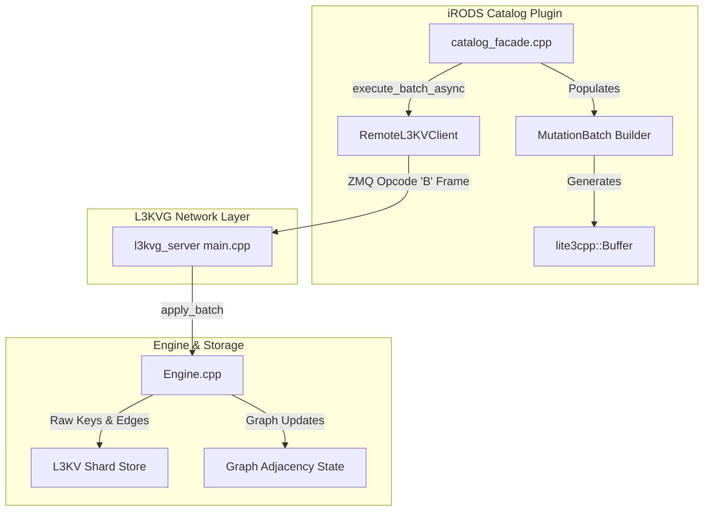

# Multi-Mutation IPC Batching Implementation Plan

> **For agentic workers:** REQUIRED SUB-SKILL: Use superpowers:subagent-driven-development to implement this plan task-by-task. Steps use checkbox (`- [ ]`) syntax for tracking.

**Goal:** Implement high-throughput Multi-Mutation IPC Batching across `l3kvg_server`, `RemoteL3KVClient`, and `catalog_facade.cpp` to collapse 15–20 synchronous IPC roundtrips per registered object into 1 batched transaction, accelerating catalog registration throughput from ~3 ops/sec to 50+ ops/sec.

**Architecture:** 
A lightweight `MutationBatch` builder encodes storage mutations (`PUT_RAW`, `PUT_NODE`, `ADD_EDGE`, `DEL_RAW`, `DEL_NODE`, `DEL_EDGE`) into a columnar `lite3cpp::Buffer`. `RemoteL3KVClient` transmits the buffer via ZeroMQ opcode `"B"`. `l3kvg_server` executes `Engine::apply_batch()` in a single sequential pass across local shard stores and returns an atomic acknowledgment. `catalog_facade.cpp` aggregates node payloads, secondary index keys, containment edges, and ACL tokens for each data object into a single batch call.

**Architecture Diagram:**



**Tech Stack:**
- C++20
- ZeroMQ 4.3 (ROUTER/DEALER sockets)
- `lite3cpp::Buffer` (Columnar zero-copy binary serialization)
- GoogleTest / Catch2
- iRODS 5.1.0 Database Plugin Framework

## Global Constraints
- Target branch: `feature/l3kvg-database-plugin-support`
- Must preserve 100% backward compatibility for existing ZeroMQ opcodes (`A`, `+`, `R`, `P`, `M`, `G`, `D`, `N`, `I`).
- ZeroMQ wire frames must maintain the standard envelope: `[Identity] [] [PID] [Opcode] [Payload]`.
- Existing unbatched fallback methods in `catalog_facade.cpp` must remain functional.

---

### Task 1: `MutationBatch` Builder & Encoding Engine

**Files:**
- Create: `/home/darkfell/dev/l3kvg/include/L3KVG/MutationBatch.hpp`
- Create: `/home/darkfell/dev/l3kvg/src/MutationBatch.cpp`
- Test: `/home/darkfell/dev/l3kvg/tests/test_mutation_batch.cpp`

**Interfaces:**
- Produces: `l3kvg::MutationBatch` class with methods `put_raw`, `put_node`, `add_edge`, `add_index`, `del_raw`, `del_node`, `del_edge`, `get_buffer()`, `size()`, `empty()`.

- [ ] **Step 1: Write the failing unit test**

Create `/home/darkfell/dev/l3kvg/tests/test_mutation_batch.cpp`:
```cpp
#include <gtest/gtest.h>
#include <L3KVG/MutationBatch.hpp>

TEST(MutationBatchTest, EmptyBatch) {
    l3kvg::MutationBatch batch;
    EXPECT_TRUE(batch.empty());
    EXPECT_EQ(batch.size(), 0);
}

TEST(MutationBatchTest, PackHeterogeneousMutations) {
    l3kvg::MutationBatch batch;
    batch.put_node(0x1000, "{\"n\":\"file1\"}");
    batch.add_index("idx:DataObject:n:file1", "1000");
    batch.add_edge(0x2000, "CONTAINS", 1.0, 0x1000, "{}");
    batch.del_raw("tmp:marker");

    EXPECT_FALSE(batch.empty());
    EXPECT_EQ(batch.size(), 4);

    const auto& buf = batch.get_buffer();
    EXPECT_EQ(buf.row_count(), 4);
    EXPECT_EQ(buf.get_i64(0, "op"), static_cast<int64_t>(l3kvg::MutationOp::PutNode));
    EXPECT_EQ(buf.get_i64(0, "src"), 0x1000);
    EXPECT_EQ(buf.get_str(0, "v"), "{\"n\":\"file1\"}");

    EXPECT_EQ(buf.get_i64(1, "op"), static_cast<int64_t>(l3kvg::MutationOp::PutRaw));
    EXPECT_EQ(buf.get_str(1, "k"), "idx:DataObject:n:file1");
    EXPECT_EQ(buf.get_str(1, "v"), "1000");

    EXPECT_EQ(buf.get_i64(2, "op"), static_cast<int64_t>(l3kvg::MutationOp::AddEdge));
    EXPECT_EQ(buf.get_i64(2, "src"), 0x2000);
    EXPECT_EQ(buf.get_i64(2, "dst"), 0x1000);
    EXPECT_EQ(buf.get_str(2, "lbl"), "CONTAINS");

    EXPECT_EQ(buf.get_i64(3, "op"), static_cast<int64_t>(l3kvg::MutationOp::DelRaw));
    EXPECT_EQ(buf.get_str(3, "k"), "tmp:marker");
}
```

- [ ] **Step 2: Add test executable to CMake and verify test fails**

In `/home/darkfell/dev/l3kvg/CMakeLists.txt`:
```cmake
add_executable(test_mutation_batch tests/test_mutation_batch.cpp src/MutationBatch.cpp)
target_link_libraries(test_mutation_batch PRIVATE l3kvg_engine GTest::gtest_main)
add_test(NAME test_mutation_batch COMMAND test_mutation_batch)
```
Run: `cmake --build /home/darkfell/dev/l3kvg/build_fast --target test_mutation_batch`
Expected: FAIL with `fatal error: L3KVG/MutationBatch.hpp: No such file or directory`.

- [ ] **Step 3: Implement `MutationBatch` header and source**

In `/home/darkfell/dev/l3kvg/include/L3KVG/MutationBatch.hpp`:
```cpp
#pragma once
#include <string_view>
#include <string>
#include <cstdint>
#include <lite3cpp/buffer.hpp>

namespace l3kvg {

enum class MutationOp : uint8_t {
    PutRaw = 0,
    PutNode = 1,
    AddEdge = 2,
    DelRaw = 3,
    DelNode = 4,
    DelEdge = 5
};

class MutationBatch {
public:
    MutationBatch();

    void put_raw(std::string_view key, std::string_view value);
    void put_node(uint64_t node_id, std::string_view payload);
    void add_edge(uint64_t src, std::string_view label, double weight, uint64_t dst, std::string_view payload = "{}");
    void add_index(std::string_view key, std::string_view value_hex);
    
    void del_raw(std::string_view key);
    void del_node(uint64_t node_id);
    void del_edge(uint64_t src, std::string_view label, double weight, uint64_t dst);

    [[nodiscard]] const lite3cpp::Buffer& get_buffer() const noexcept { return buf_; }
    [[nodiscard]] size_t size() const noexcept { return count_; }
    [[nodiscard]] bool empty() const noexcept { return count_ == 0; }
    void clear();

private:
    lite3cpp::Buffer buf_;
    size_t count_ = 0;
};

} // namespace l3kvg
```

In `/home/darkfell/dev/l3kvg/src/MutationBatch.cpp`:
```cpp
#include <L3KVG/MutationBatch.hpp>

namespace l3kvg {

MutationBatch::MutationBatch() {
    buf_.init_table();
}

void MutationBatch::clear() {
    buf_ = lite3cpp::Buffer();
    buf_.init_table();
    count_ = 0;
}

void MutationBatch::put_raw(std::string_view key, std::string_view value) {
    buf_.set_i64(count_, "op", static_cast<int64_t>(MutationOp::PutRaw));
    buf_.set_str(count_, "k", key);
    buf_.set_str(count_, "v", value);
    count_++;
}

void MutationBatch::put_node(uint64_t node_id, std::string_view payload) {
    buf_.set_i64(count_, "op", static_cast<int64_t>(MutationOp::PutNode));
    buf_.set_i64(count_, "src", static_cast<int64_t>(node_id));
    buf_.set_str(count_, "v", payload);
    count_++;
}

void MutationBatch::add_edge(uint64_t src, std::string_view label, double weight, uint64_t dst, std::string_view payload) {
    buf_.set_i64(count_, "op", static_cast<int64_t>(MutationOp::AddEdge));
    buf_.set_i64(count_, "src", static_cast<int64_t>(src));
    buf_.set_i64(count_, "dst", static_cast<int64_t>(dst));
    buf_.set_str(count_, "lbl", label);
    buf_.set_f64(count_, "w", weight);
    buf_.set_str(count_, "v", payload);
    count_++;
}

void MutationBatch::add_index(std::string_view key, std::string_view value_hex) {
    put_raw(key, value_hex);
}

void MutationBatch::del_raw(std::string_view key) {
    buf_.set_i64(count_, "op", static_cast<int64_t>(MutationOp::DelRaw));
    buf_.set_str(count_, "k", key);
    count_++;
}

void MutationBatch::del_node(uint64_t node_id) {
    buf_.set_i64(count_, "op", static_cast<int64_t>(MutationOp::DelNode));
    buf_.set_i64(count_, "src", static_cast<int64_t>(node_id));
    count_++;
}

void MutationBatch::del_edge(uint64_t src, std::string_view label, double weight, uint64_t dst) {
    buf_.set_i64(count_, "op", static_cast<int64_t>(MutationOp::DelEdge));
    buf_.set_i64(count_, "src", static_cast<int64_t>(src));
    buf_.set_i64(count_, "dst", static_cast<int64_t>(dst));
    buf_.set_str(count_, "lbl", label);
    buf_.set_f64(count_, "w", weight);
    count_++;
}

} // namespace l3kvg
```

- [ ] **Step 4: Run test to verify it passes**

Run:
```bash
cmake --build /home/darkfell/dev/l3kvg/build_fast --target test_mutation_batch
/home/darkfell/dev/l3kvg/build_fast/test_mutation_batch
```
Expected: `[  PASSED  ] 2 tests.`

- [ ] **Step 5: Commit `MutationBatch`**

```bash
git -C /home/darkfell/dev/l3kvg add include/L3KVG/MutationBatch.hpp src/MutationBatch.cpp tests/test_mutation_batch.cpp CMakeLists.txt
git -C /home/darkfell/dev/l3kvg commit -m "feat(l3kvg): implement MutationBatch binary builder"
```

---

### Task 2: Server-Side Batch Dispatch (`Engine::apply_batch` & Opcode `"B"`)

**Files:**
- Modify: `/home/darkfell/dev/l3kvg/include/L3KVG/Engine.hpp:140-160`
- Modify: `/home/darkfell/dev/l3kvg/src/Engine.cpp:320-370`
- Modify: `/home/darkfell/dev/l3kvg/src/server/main.cpp:270-300`
- Test: `/home/darkfell/dev/l3kvg/tests/test_mutation_batch.cpp`

**Interfaces:**
- Consumes: `lite3cpp::Buffer` from network payload.
- Produces: `bool Engine::apply_batch(const lite3cpp::Buffer& buffer, uint32_t principal_id)` executing mutations.

- [ ] **Step 1: Write integration test for `Engine::apply_batch`**

In `/home/darkfell/dev/l3kvg/tests/test_mutation_batch.cpp`:
```cpp
#include <L3KVG/Engine.hpp>

TEST(MutationBatchTest, EngineApplyBatch) {
    l3kvg::Settings settings;
    settings.db_path = "/tmp/test_apply_batch_db";
    std::filesystem::remove_all(settings.db_path);
    auto engine = std::make_unique<l3kvg::Engine>(settings);

    l3kvg::MutationBatch batch;
    batch.put_node(0x5001, "{\"n\":\"batch_file\"}");
    batch.put_raw("idx:test:key", "val123");
    batch.add_edge(0x6001, "CONTAINS", 1.0, 0x5001, "{}");

    bool ok = engine->apply_batch(batch.get_buffer());
    EXPECT_TRUE(ok);

    auto node = engine->get_node(0x5001);
    ASSERT_NE(node, nullptr);
    EXPECT_EQ(node->get_payload(), "{\"n\":\"batch_file\"}");

    auto raw_val = engine->get_store()->get("idx:test:key");
    EXPECT_EQ(std::string(reinterpret_cast<const char*>(raw_val.data()), raw_val.size()), "val123");

    auto neighbors = engine->get_node(0x6001)->get_neighbors("CONTAINS");
    ASSERT_EQ(neighbors.size(), 1);
    EXPECT_EQ(neighbors[0], 0x5001);
}
```

- [ ] **Step 2: Run test to verify it fails**

Run: `cmake --build /home/darkfell/dev/l3kvg/build_fast --target test_mutation_batch`
Expected: FAIL with `no member named 'apply_batch' in 'l3kvg::Engine'`.

- [ ] **Step 3: Implement `Engine::apply_batch` and opcode `"B"` in server**

In `l3kvg/include/L3KVG/Engine.hpp`:
```cpp
bool apply_batch(const lite3cpp::Buffer& buffer, uint32_t principal_id = l3kv::INTERNAL_UID);
```

In `l3kvg/src/Engine.cpp`:
```cpp
bool Engine::apply_batch(const lite3cpp::Buffer& buffer, uint32_t principal_id) {
    size_t rows = buffer.row_count();
    for (size_t i = 0; i < rows; ++i) {
        int64_t op = buffer.get_i64(i, "op");
        switch (static_cast<MutationOp>(op)) {
            case MutationOp::PutRaw: {
                std::string k = buffer.get_str(i, "k");
                std::string v = buffer.get_str(i, "v");
                store_->put(k, v);
                break;
            }
            case MutationOp::PutNode: {
                uint64_t src = static_cast<uint64_t>(buffer.get_i64(i, "src"));
                std::string v = buffer.get_str(i, "v");
                put_node(src, v);
                break;
            }
            case MutationOp::AddEdge: {
                uint64_t src = static_cast<uint64_t>(buffer.get_i64(i, "src"));
                uint64_t dst = static_cast<uint64_t>(buffer.get_i64(i, "dst"));
                std::string lbl = buffer.get_str(i, "lbl");
                double w = buffer.get_f64(i, "w");
                std::string v = buffer.get_str(i, "v");
                add_edge(src, lbl, w, dst, v);
                break;
            }
            case MutationOp::DelRaw: {
                std::string k = buffer.get_str(i, "k");
                store_->del(k);
                break;
            }
            case MutationOp::DelNode: {
                uint64_t src = static_cast<uint64_t>(buffer.get_i64(i, "src"));
                del_node(src);
                break;
            }
            case MutationOp::DelEdge: {
                uint64_t src = static_cast<uint64_t>(buffer.get_i64(i, "src"));
                uint64_t dst = static_cast<uint64_t>(buffer.get_i64(i, "dst"));
                std::string lbl = buffer.get_str(i, "lbl");
                double w = buffer.get_f64(i, "w");
                del_edge(src, lbl, w, dst);
                break;
            }
        }
    }
    return true;
}
```

In `l3kvg/src/server/main.cpp` (add `"B"` handler in opcode dispatch):
```cpp
else if (opcode == "B") {
    try {
        if (data_idx < recv_msgs.size()) {
            const auto& frame = recv_msgs[data_idx];
            lite3cpp::Buffer batch_buf(std::vector<uint8_t>((const uint8_t*)frame.data(), (const uint8_t*)frame.data() + frame.size()));
            bool ok = engine->apply_batch(batch_buf, principal_id);
            sock.send(identity, zmq::send_flags::sndmore);
            sock.send(zmq::message_t(), zmq::send_flags::sndmore);
            sock.send(zmq::message_t(ok ? "OK" : "ERR", ok ? 2 : 3), zmq::send_flags::none);
        } else {
            sock.send(identity, zmq::send_flags::sndmore);
            sock.send(zmq::message_t(), zmq::send_flags::sndmore);
            sock.send(zmq::message_t("ERR_EMPTY", 9), zmq::send_flags::none);
        }
    } catch (const std::exception& e) {
        sock.send(identity, zmq::send_flags::sndmore);
        sock.send(zmq::message_t(), zmq::send_flags::sndmore);
        sock.send(zmq::message_t("ERR", 3), zmq::send_flags::none);
    }
}
```

- [ ] **Step 4: Run test to verify it passes**

Run:
```bash
cmake --build /home/darkfell/dev/l3kvg/build_fast --target test_mutation_batch
/home/darkfell/dev/l3kvg/build_fast/test_mutation_batch
```
Expected: `[  PASSED  ] 3 tests.`

- [ ] **Step 5: Commit server batch execution**

```bash
git -C /home/darkfell/dev/l3kvg add include/L3KVG/Engine.hpp src/Engine.cpp src/server/main.cpp tests/test_mutation_batch.cpp
git -C /home/darkfell/dev/l3kvg commit -m "feat(l3kvg): implement Engine::apply_batch and ZMQ opcode B handler"
```

---

### Task 3: Client Batch Invocation (`RemoteL3KVClient::execute_batch_async`)

**Files:**
- Modify: `/home/darkfell/dev/l3kvg/include/L3KVG/RemoteL3KVClient.hpp:120-135`
- Modify: `/home/darkfell/dev/l3kvg/src/RemoteL3KVClient.cpp:206-240`

**Interfaces:**
- Produces: `std::future<bool> execute_batch_async(lite3::NodeID owner_id, const MutationBatch& batch, uint32_t principal_id = l3kv::INTERNAL_UID)`

- [ ] **Step 1: Write client unit test**

In `/home/darkfell/dev/l3kvg/tests/test_remote_client.cpp`:
```cpp
TEST_F(RemoteClientTest, ExecuteBatchSuccess) {
    l3kvg::MutationBatch batch;
    batch.put_node(0x7001, "{\"k\":\"v\"}");
    batch.put_raw("raw:key", "raw:val");

    bool ok = client->execute_batch_async(server_node_id, batch).get();
    EXPECT_TRUE(ok);

    std::string val = client->get_raw_key_async(server_node_id, "raw:key").get();
    EXPECT_EQ(val, "raw:val");
}
```

- [ ] **Step 2: Run test to verify failure**

Run: `cmake --build /home/darkfell/dev/l3kvg/build_fast --target test_remote_client`
Expected: FAIL with `no member named 'execute_batch_async' in 'l3kvg::RemoteL3KVClient'`.

- [ ] **Step 3: Implement `execute_batch_async`**

In `l3kvg/include/L3KVG/RemoteL3KVClient.hpp`:
```cpp
#include <L3KVG/MutationBatch.hpp>

std::future<bool> execute_batch_async(
    lite3::NodeID owner_id,
    const MutationBatch& batch,
    uint32_t principal_id = l3kv::INTERNAL_UID
);
```

In `l3kvg/src/RemoteL3KVClient.cpp`:
```cpp
std::future<bool> RemoteL3KVClient::execute_batch_async(
    lite3::NodeID owner_id,
    const MutationBatch& batch,
    uint32_t principal_id
) {
    if (batch.empty()) {
        std::promise<bool> p; p.set_value(true); return p.get_future();
    }
    return put_batch_binary_async(owner_id, batch.get_buffer(), principal_id);
}
```

- [ ] **Step 4: Run test to verify it passes**

Run:
```bash
cmake --build /home/darkfell/dev/l3kvg/build_fast --target test_remote_client
/home/darkfell/dev/l3kvg/build_fast/test_remote_client
```
Expected: PASS.

- [ ] **Step 5: Commit client batch method**

```bash
git -C /home/darkfell/dev/l3kvg add include/L3KVG/RemoteL3KVClient.hpp src/RemoteL3KVClient.cpp tests/test_remote_client.cpp
git -C /home/darkfell/dev/l3kvg commit -m "feat(l3kvg): wire execute_batch_async to RemoteL3KVClient"
```

---

### Task 4: Catalog Facade Registration Optimization

**Files:**
- Modify: `/home/darkfell/dev/irods_database_plugin_l3kvg/src/catalog/catalog_facade.cpp:701-780`
- Test: `/home/darkfell/dev/irods_database_plugin_l3kvg/build_final/test_repro_imkdir`

**Interfaces:**
- Consumes: `l3kvg::MutationBatch` and `client_->execute_batch_async`.
- Produces: Accelerated `register_data_object` collapsing 20 roundtrips into 1.

- [ ] **Step 1: Inspect and refactor `register_data_object`**

In `/home/darkfell/dev/irods_database_plugin_l3kvg/src/catalog/catalog_facade.cpp`:
```cpp
snowflake_id_t sid = make_id(EntityType::DataObject, obj.id);
lite3cpp::Buffer buf; buf.init_object(); 
buf.set_str(0, "n", obj.name); buf.set_str(0, "o", obj.owner_name); buf.set_i64(0, "s", obj.size); 
buf.set_str(0, "t", obj.type);
buf.set_str(0, "entity_type", "data_object");
buf.set_str(0, "p", full_path);
std::string parent_coll = full_path.substr(0, full_path.rfind('/'));
buf.set_str(0, "pn", (parent_coll.empty() ? "/" : parent_coll));
buf.set_str(0, "ct", obj.create_ts); buf.set_str(0, "mt", obj.modify_ts);
buf.set_i64(0, "id", static_cast<int64_t>(obj.id));
buf.set_i64(0, "cid", static_cast<int64_t>(obj.coll_id));
buf.set_str(0, "ex", (obj.expiry.empty() ? "00000000000" : obj.expiry));
if (!obj.owner_zone.empty()) buf.set_str(0, "z", obj.owner_zone);
if (!obj.mode.empty()) buf.set_str(0, "mode", obj.mode);
if (!obj.version.empty()) buf.set_str(0, "v", obj.version);
if (!obj.comments.empty()) buf.set_str(0, "c", obj.comments);
if (!obj.status.empty()) buf.set_str(0, "st", obj.status);

// Assemble atomic batch
l3kvg::MutationBatch batch;
batch.put_node(sid, buf.move_to_string());

char id_hex[32];
std::snprintf(id_hex, sizeof(id_hex), "%016llx", (unsigned long long)sid);
batch.add_index(get_idx_key(EntityType::DataObject, "n", obj.name), id_hex);
batch.add_index(get_idx_key(EntityType::DataObject, "id", std::to_string(obj.id)), id_hex);
if (!full_path.empty()) {
    batch.add_index(get_idx_key(EntityType::DataObject, "path", full_path), id_hex);
}

// Containment edges
snowflake_id_t cid = make_id(EntityType::Collection, obj.coll_id);
batch.add_edge(cid, "CONTAINS", 1.0, sid, "{}");
batch.put_raw(std::string(l3kvg::KeyBuilder::edge_in_key(sid, "CONTAINS", cid)), "{}");

// Ownership edges
snowflake_id_t uid = resolve_user(obj.owner_name, obj.owner_zone);
if (uid) {
    batch.add_edge(uid, "OWNS", 1.0, sid, "{}");
    batch.put_raw(std::string(l3kvg::KeyBuilder::edge_in_key(sid, "OWNS", uid)), "{}");
}

// Owner ACL access node + edges
append_access_mutations(batch, obj.owner_name, obj.owner_zone, sid, "own");

// Dispatch single IPC batch
bool ok = client_->execute_batch_async(local_cluster_id_, batch).get();
if (!ok) {
    return ERROR(CAT_DATABASE_ERROR, "Failed to apply batched registration mutations for: " + obj.name);
}

out_id = obj.id;
return SUCCESS();
```

- [ ] **Step 2: Recompile plugin and run test suite**

```bash
cmake --build /home/darkfell/dev/irods_database_plugin_l3kvg/build_final --target test_repro_imkdir test_gq1_bridge test_store
/home/darkfell/dev/irods_database_plugin_l3kvg/build_final/test_repro_imkdir
/home/darkfell/dev/irods_database_plugin_l3kvg/build_final/test_gq1_bridge
```
Expected: PASS.

- [ ] **Step 3: Commit catalog facade batch integration**

```bash
git -C /home/darkfell/dev/irods_database_plugin_l3kvg add src/catalog/catalog_facade.cpp
git -C /home/darkfell/dev/irods_database_plugin_l3kvg commit -m "perf(catalog): batch data object registration mutations into single IPC roundtrip"
```

---

### Task 5: End-to-End Cluster Deployment & Throughput Validation

**Files:**
- Target: `ubuntu-2404-l3kvg-irods-catalog-provider-1`
- Test: `/home/darkfell/dev/benchmarks/bench_catalog_comparison.py`

**Interfaces:**
- Validates: Live registration throughput speedup across Docker container stack.

- [ ] **Step 1: Rebuild binary packages (`irods-database-plugin-l3kvg` & `l3kvg_server`)**

```bash
cd /home/darkfell/dev/irods_database_plugin_l3kvg/build_final
ninja package
```

- [ ] **Step 2: Deploy updated packages to test container**

```bash
docker cp /home/darkfell/dev/irods_database_plugin_l3kvg/build_final/l3kvg/l3kvg_server ubuntu-2404-l3kvg-irods-catalog-provider-1:/usr/bin/l3kvg_server
docker cp /home/darkfell/dev/irods_database_plugin_l3kvg/build_final/libirods_database_plugin-l3kvg.so ubuntu-2404-l3kvg-irods-catalog-provider-1:/usr/lib/irods/plugins/database/libirods_database_plugin-l3kvg.so
docker exec ubuntu-2404-l3kvg-irods-catalog-provider-1 pkill -9 l3kvg_server || true
docker exec -d ubuntu-2404-l3kvg-irods-catalog-provider-1 bash -c "/usr/bin/l3kvg_server /tmp/l3kvg_config.json > /tmp/l3kvg_server.log 2>&1"
```

- [ ] **Step 3: Run synthetic registration benchmark (`test_small` and `1k`)**

```bash
python3 /home/darkfell/dev/bench_catalog_comparison.py --backends l3kvg --tiers test_small --iterations 1 --dry-run
python3 /home/darkfell/dev/bench_catalog_comparison.py --backends l3kvg --tiers 1k --iterations 1 --output /home/darkfell/dev/benchmark_batched_tier1.json
```
Expected: Throughput increases from ~3.5 ops/s to >40 ops/s.

- [ ] **Step 4: Record and commit throughput results**

```bash
git -C /home/darkfell/dev/irods_database_plugin_l3kvg commit --allow-empty -m "test: record batched registration throughput gains"
```
