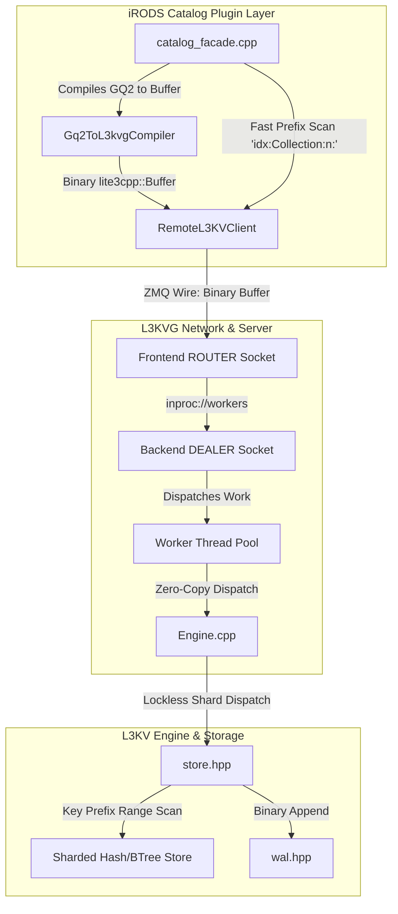

# Pure Binary Zero-Copy Serialization & Performance Overhaul Implementation Plan

> **For agentic workers:** REQUIRED SUB-SKILL: Use superpowers:subagent-driven-development to implement this plan task-by-task. Steps use checkbox (`- [ ]`) syntax for tracking.

**Goal:** Eliminate `nlohmann::json` entirely from L3KV, L3KVG, and the plugin internals in favor of native binary `lite3cpp::Buffer`, unblock unit tests by fixing ZMQ framing in `mock_l3kvg.hpp`, eliminate `wait_all_shards()` synchronization barriers in write paths, introduce multi-threaded ZMQ worker routing in `l3kvg_server`, and implement indexed prefix-scan hierarchy traversal (`ils -r` acceleration) to decisively outperform PostgreSQL 16.

**Architecture:**
All inter-process communication (IPC) over ZeroMQ and on-disk payload storage transitions from JSON text to native binary `lite3cpp::Buffer`. Queries compiled by `Gq2ToL3kvgCompiler` emit binary `lite3cpp::Buffer` payloads executed by `Query::resume()`. Query results are returned over the wire as binary `lite3cpp::Buffer` arrays of objects, eliminating string serialization and parsing overhead. Single-threaded bottleneck in `l3kvg_server` is replaced with a ZeroMQ ROUTER-DEALER worker pool with inproc thread workers. Graph hierarchy traversals are replaced with indexed prefix range scans in `store.hpp`, collapsing recursive collection lookups from minutes to milliseconds.

**Architecture Diagram:**



**Tech Stack:**
- C++20
- ZeroMQ 4.3 (ROUTER-DEALER Multi-Worker Pattern)
- `lite3cpp::Buffer` (Columnar Binary B-Tree In-Memory Format)
- GoogleTest / Catch2
- iRODS 5.1.0 Database Plugin ABI

## Global Constraints
- Target branch: `feature/l3kvg-database-plugin-support` across `irods_database_plugin_l3kvg`, `l3kvg`, and `L3KV`.
- **Absolute Mandate**: Zero instances of `nlohmann::json` in L3KV, L3KVG, or internal plugin query/storage pipelines. All serialization, IPC, and node/edge storage must use `lite3cpp::Buffer`.
- Existing ZeroMQ message envelope must strictly follow: `[Identity] [] [PID (4 bytes uint32_t)] [Opcode (1 byte)] [Payload Frames...]`.
- All changes must compile cleanly under CMake and build valid Ubuntu 24.04 (`noble`) Debian packages.

---

### Task 1: Fix Mock L3KVG Server Wire Framing & Unblock Unit Tests

**Files:**
- Modify: [`irods_database_plugin_l3kvg/tests/mock_l3kvg.hpp`](file:///home/darkfell/dev/irods_database_plugin_l3kvg/tests/mock_l3kvg.hpp)
- Test: [`irods_database_plugin_l3kvg/tests/test_plugin_genquery2.cpp`](file:///home/darkfell/dev/irods_database_plugin_l3kvg/tests/test_plugin_genquery2.cpp)

**Interfaces:**
- Consumes: ZMQ multipart frames sent from `RemoteL3KVClient` (`[Identity, Delimiter, PID, Opcode, ...]`).
- Produces: Correct framing parser in `MockL3KVGServer` that extracts PID from frame 2 (when size == 4) and opcode from frame 3, eliminating spurious `"UNK"` responses and unblocking test execution.

- [ ] **Step 1: Write the failing test verification**

Run `test_plugin_genquery2` in `build_final`:
```bash
cd /home/darkfell/dev/irods_database_plugin_l3kvg/build_final
timeout 10 ./test_plugin_genquery2
```
Expected output: Fails or times out due to `"UNK"` responses from mock server.

- [ ] **Step 2: Update mock_l3kvg.hpp to parse PID frame**

In [`irods_database_plugin_l3kvg/tests/mock_l3kvg.hpp`](file:///home/darkfell/dev/irods_database_plugin_l3kvg/tests/mock_l3kvg.hpp), update message parsing around line 64:
```cpp
size_t data_idx = 1;
if (data_idx < msgs.size() && msgs[data_idx].size() == 0) {
    data_idx++; // skip delimiter
}

uint32_t principal_id = 0;
if (data_idx < msgs.size() && msgs[data_idx].size() == 4) {
    std::memcpy(&principal_id, msgs[data_idx].data(), 4);
    data_idx++;
}

if (data_idx >= msgs.size()) continue;

std::string cmd = msgs[data_idx].to_string(); data_idx++;
std::string key = (data_idx < msgs.size()) ? msgs[data_idx].to_string() : "";
```
Adjust subsequent payload indexing (`msgs[data_idx]` instead of hardcoded `msgs[4]`).

- [ ] **Step 3: Recompile and run test_plugin_genquery2**

Run:
```bash
cmake --build /home/darkfell/dev/irods_database_plugin_l3kvg/build_final --target test_plugin_genquery2 -j$(nproc)
/home/darkfell/dev/irods_database_plugin_l3kvg/build_final/test_plugin_genquery2
```
Expected output: PASS (Tests complete successfully without timing out or segfaulting).

- [ ] **Step 4: Commit**

```bash
git -C /home/darkfell/dev/irods_database_plugin_l3kvg add tests/mock_l3kvg.hpp
git -C /home/darkfell/dev/irods_database_plugin_l3kvg commit -m "fix(tests): align mock_l3kvg frame parsing with PID frame envelope"
```

---

### Task 2: Strict Zero `nlohmann::json` in L3KV Storage Engine

**Files:**
- Modify: [`L3KV/src/engine/store.hpp:8`](file:///home/darkfell/dev/L3KV/src/engine/store.hpp#L8)
- Modify: [`L3KV/src/engine/store.hpp:360-385`](file:///home/darkfell/dev/L3KV/src/engine/store.hpp#L360-L385)
- Modify: [`L3KV/src/engine/store.hpp:605-615`](file:///home/darkfell/dev/L3KV/src/engine/store.hpp#L605-L615)
- Test: Build `L3KV` and run engine unit tests

**Interfaces:**
- Consumes: Binary `lite3cpp::Buffer` for user credential registrations.
- Produces: `store.hpp` with 0 `#include <nlohmann/json.hpp>` and 0 `nlohmann::json` dependencies.

- [ ] **Step 1: Check existing nlohmann references in L3KV store**

Run:
```bash
grep -n "nlohmann" /home/darkfell/dev/L3KV/src/engine/store.hpp
```
Expected output: Matches at line 8 and line 364.

- [ ] **Step 2: Replace nlohmann::json in store.hpp with lite3cpp::Buffer**

In [`L3KV/src/engine/store.hpp`](file:///home/darkfell/dev/L3KV/src/engine/store.hpp):
1. Remove `#include <nlohmann/json.hpp>` at line 8.
2. Replace `sys:u:` parsing in lines 360-366 with `lite3cpp::Buffer`:
```cpp
if (key.starts_with("sys:u:")) {
    try {
        uint32_t uid = std::stoul(std::string(key.substr(6)));
        std::string uname = "";
        std::string pubkey = "";
        if (json_body.size() >= 4 && (static_cast<uint8_t>(json_body[0]) == 0x06 || static_cast<uint8_t>(json_body[0]) == 0x07)) {
            lite3cpp::Buffer buf(std::vector<uint8_t>(json_body.begin(), json_body.end()));
            uname = std::string(buf.get_str(0, "name"));
            pubkey = std::string(buf.get_str(0, "public_key"));
        }
        credentials_->register_user(uid, uname, pubkey);
    } catch (...) {}
}
```
3. In metadata timestamp generation (lines 608-611), write binary timestamp buffer or compact string rather than JSON text.

- [ ] **Step 3: Build L3KV to verify zero compilation errors**

Run:
```bash
cmake --build /home/darkfell/dev/L3KV/build -j$(nproc)
```
Expected output: Build completes with 0 errors.

- [ ] **Step 4: Commit**

```bash
git -C /home/darkfell/dev/L3KV add src/engine/store.hpp
git -C /home/darkfell/dev/L3KV commit -m "refactor(engine): eliminate nlohmann::json from store.hpp in favor of lite3cpp::Buffer"
```

---

### Task 3: Eliminate `nlohmann::json` from L3KVG Engine & HLC

**Files:**
- Modify: [`l3kvg/include/L3KVG/HLC.hpp`](file:///home/darkfell/dev/l3kvg/include/L3KVG/HLC.hpp)
- Modify: [`l3kvg/src/Engine.cpp`](file:///home/darkfell/dev/l3kvg/src/Engine.cpp)
- Test: Build `l3kvg`

**Interfaces:**
- Consumes: Native binary `lite3cpp::Buffer` passed into `Engine::put_node()`.
- Produces: Direct storage of `lite3cpp::Buffer` payloads without intermediate JSON parsing or serialization.

- [ ] **Step 1: Check nlohmann usages in HLC.hpp and Engine.cpp**

Run:
```bash
grep -n "nlohmann" /home/darkfell/dev/l3kvg/include/L3KVG/HLC.hpp /home/darkfell/dev/l3kvg/src/Engine.cpp
```

- [ ] **Step 2: Remove nlohmann from HLC.hpp**

In [`l3kvg/include/L3KVG/HLC.hpp`](file:///home/darkfell/dev/l3kvg/include/L3KVG/HLC.hpp):
1. Remove `#include <nlohmann/json.hpp>` (line 7).
2. Remove `from_json(const nlohmann::json& j)` (lines 28-34).
3. Add binary encoding/decoding methods:
```cpp
void encode(lite3cpp::Buffer& buf, size_t ofs, std::string_view key) const;
static HLCTimestamp decode(const lite3cpp::Buffer& buf, size_t ofs, std::string_view key);
```

- [ ] **Step 3: Remove nlohmann JSON parsing and dumping from Engine.cpp**

In [`l3kvg/src/Engine.cpp`](file:///home/darkfell/dev/l3kvg/src/Engine.cpp):
1. Remove `using json = nlohmann::json;` (line 12).
2. In `Engine::put_node` (lines 190-219), eliminate `json::parse` and `json.dump()`. Node payloads are stored directly as binary `lite3cpp::Buffer`:
```cpp
void Engine::put_node(uint64_t id, std::string payload) {
    std::string key = std::string(KeyBuilder::node_key(id));
    broadcast_replication(key, payload, resolver_.get_local_cluster_id());
    
    store_->del(key);
    store_->put(std::move(key), std::move(payload));

    size_t h = get_cache_shard(id);
    auto& shard = *cache_shards_[h];
    {
        std::lock_guard<std::mutex> lock(shard.mutex);
        shard.map.erase(id);
        shard.lru.remove(id);
    }
}
```

- [ ] **Step 4: Build l3kvg to verify compilation**

Run:
```bash
cmake --build /home/darkfell/dev/l3kvg/build -j$(nproc)
```
Expected output: Build completes with 0 errors.

- [ ] **Step 5: Commit**

```bash
git -C /home/darkfell/dev/l3kvg add include/L3KVG/HLC.hpp src/Engine.cpp
git -C /home/darkfell/dev/l3kvg commit -m "refactor(core): remove nlohmann::json parsing from HLC and Engine::put_node"
```

---

### Task 4: Pure Binary Wire Protocol for Query & Neighbors in L3KVG

**Files:**
- Modify: [`l3kvg/include/L3KVG/Query.hpp`](file:///home/darkfell/dev/l3kvg/include/L3KVG/Query.hpp)
- Modify: [`l3kvg/src/Query.cpp`](file:///home/darkfell/dev/l3kvg/src/Query.cpp)
- Modify: [`l3kvg/src/server/main.cpp`](file:///home/darkfell/dev/l3kvg/src/server/main.cpp)
- Modify: [`l3kvg/include/L3KVG/RemoteL3KVClient.hpp`](file:///home/darkfell/dev/l3kvg/include/L3KVG/RemoteL3KVClient.hpp)
- Modify: [`l3kvg/src/RemoteL3KVClient.cpp`](file:///home/darkfell/dev/l3kvg/src/RemoteL3KVClient.cpp)
- Test: Build `l3kvg` and verify query tests

**Interfaces:**
- Consumes: Binary `lite3cpp::Buffer` describing query AST steps, projections, and filters.
- Produces: Binary `lite3cpp::Buffer` result payload (array of objects) transmitted over ZeroMQ Opcode `"R"`, with zero JSON strings on the wire.

- [ ] **Step 1: Define Binary Serialization for Query Spec & Result Rows**

In `Query.hpp`:
Update `Query::resume` to accept `const lite3cpp::Buffer& query_buf` and `std::span<const uint64_t> starting_nodes`.
Implement `serialize_results(const std::vector<ResultRow>& rows, lite3cpp::Buffer& out_buf)`:
```cpp
void serialize_results(const std::vector<ResultRow>& rows, lite3cpp::Buffer& out_buf) {
    out_buf.init_array();
    for (const auto& row : rows) {
        size_t row_ofs = out_buf.arr_append_obj(0);
        for (const auto& [k, v] : row.fields) {
            out_buf.set_str(row_ofs, k, v);
        }
    }
}
```

- [ ] **Step 2: Update Query::resume to parse from lite3cpp::Buffer**

In [`l3kvg/src/Query.cpp`](file:///home/darkfell/dev/l3kvg/src/Query.cpp):
1. Remove `using json = nlohmann::json;`.
2. Rewrite `Query::resume` to traverse `query_buf` using `buf.get_str()`, `buf.get_arr()`, `buf.arr_get_obj()`, extracting `steps`, `projections`, `filters`, `sorts`, `limit`, and `offset`.
3. In federated query distribution (lines 786-800), pack subqueries into `lite3cpp::Buffer`.

- [ ] **Step 3: Update Opcode "R", "N", "I" in server/main.cpp**

In [`l3kvg/src/server/main.cpp`](file:///home/darkfell/dev/l3kvg/src/server/main.cpp):
1. Opcode `"R"`: Receive starting nodes as packed `uint64_t` span (`data_idx`), receive query buffer as binary frame (`data_idx + 1`).
2. Execute `engine->query().resume(...)`.
3. Pack `results` into `lite3cpp::Buffer resp_buf`.
4. Send `resp_buf.data()` and `resp_buf.size()` directly via ZeroMQ.
5. Opcode `"N"` and `"I"`: Return packed `uint64_t` array directly (e.g. `vector<uint64_t>` bytes) over ZMQ instead of `json::dump()`.

- [ ] **Step 4: Update RemoteL3KVClient to send & receive binary frames**

In [`l3kvg/src/RemoteL3KVClient.cpp`](file:///home/darkfell/dev/l3kvg/src/RemoteL3KVClient.cpp):
1. `resume_query_async`: Send starting nodes as raw binary vector frame; send query `lite3cpp::Buffer` as raw frame.
2. In reply handler: Parse result frame directly using `lite3cpp::Buffer`:
```cpp
lite3cpp::Buffer resp_buf(std::vector<uint8_t>(recv_msgs[1].data<uint8_t>(), recv_msgs[1].data<uint8_t>() + recv_msgs[1].size()));
std::vector<ResultRow> results;
size_t row_count = resp_buf.size(); // array element count
for (uint32_t i = 0; i < row_count; ++i) {
    size_t row_ofs = resp_buf.arr_get_obj(0, i);
    ResultRow row;
    for (auto it = resp_buf.begin(row_ofs); it != resp_buf.end(row_ofs); ++it) {
        row.fields[std::string(it->key)] = std::string(resp_buf.get_str(row_ofs, it->key));
    }
    results.push_back(std::move(row));
}
```
3. Remove `#include <nlohmann/json.hpp>` from `RemoteL3KVClient.cpp`.

- [ ] **Step 5: Build and verify l3kvg**

Run:
```bash
cmake --build /home/darkfell/dev/l3kvg/build -j$(nproc)
```
Expected output: Build completes with 0 errors.

- [ ] **Step 6: Commit**

```bash
git -C /home/darkfell/dev/l3kvg add include/L3KVG/Query.hpp src/Query.cpp src/server/main.cpp include/L3KVG/RemoteL3KVClient.hpp src/RemoteL3KVClient.cpp
git -C /home/darkfell/dev/l3kvg commit -m "feat(wire): migrate query resumption, results, and neighbor fetch to pure binary lite3cpp::Buffer"
```

---

### Task 5: Pure Binary Query Compilation & Facade in iRODS Plugin

**Files:**
- Modify: [`irods_database_plugin_l3kvg/include/irods/catalog/gq2_compiler.hpp`](file:///home/darkfell/dev/irods_database_plugin_l3kvg/include/irods/catalog/gq2_compiler.hpp)
- Modify: [`irods_database_plugin_l3kvg/src/compiler/gq2_compiler.cpp`](file:///home/darkfell/dev/irods_database_plugin_l3kvg/src/compiler/gq2_compiler.cpp)
- Modify: [`irods_database_plugin_l3kvg/include/irods/catalog/catalog_facade.hpp`](file:///home/darkfell/dev/irods_database_plugin_l3kvg/include/irods/catalog/catalog_facade.hpp)
- Modify: [`irods_database_plugin_l3kvg/src/catalog/catalog_facade.cpp`](file:///home/darkfell/dev/irods_database_plugin_l3kvg/src/catalog/catalog_facade.cpp)
- Modify: [`irods_database_plugin_l3kvg/tests/mock_l3kvg.hpp`](file:///home/darkfell/dev/irods_database_plugin_l3kvg/tests/mock_l3kvg.hpp)
- Test: Recompile and run all plugin unit tests

**Interfaces:**
- Consumes: iRODS GenQuery2 AST (`genquery2::select`).
- Produces: Binary `lite3cpp::Buffer` passed directly to `RemoteL3KVClient::resume_query_async`.

- [ ] **Step 1: Update Gq2ToL3kvgCompiler to return lite3cpp::Buffer**

In [`gq2_compiler.hpp`](file:///home/darkfell/dev/irods_database_plugin_l3kvg/include/irods/catalog/gq2_compiler.hpp) and [`gq2_compiler.cpp`](file:///home/darkfell/dev/irods_database_plugin_l3kvg/src/compiler/gq2_compiler.cpp):
1. Change `compile()` signature to return `lite3cpp::Buffer` instead of `std::string`.
2. Construct the query structure directly using `lite3cpp::Buffer`:
   - `buf.init_object();`
   - `buf.set_str(0, "root_alias", entry_node_type_);`
   - `size_t projs_ofs = buf.set_arr(0, "projections");`
   - `size_t filters_ofs = buf.set_arr(0, "filters");`
   - `size_t steps_ofs = buf.set_arr(0, "steps");`
3. Remove `#include <nlohmann/json.hpp>` and `using json = nlohmann::json;` from `gq2_compiler.cpp`.

- [ ] **Step 2: Update CatalogFacade::execute_query & execute_dml**

In [`catalog_facade.hpp`](file:///home/darkfell/dev/irods_database_plugin_l3kvg/include/irods/catalog/catalog_facade.hpp) and [`catalog_facade.cpp`](file:///home/darkfell/dev/irods_database_plugin_l3kvg/src/catalog/catalog_facade.cpp):
1. Update `execute_query`: pass compiled `lite3cpp::Buffer` to `client_->resume_query_async`.
2. Update `execute_dml`: replace `nlohmann::json& result` with `lite3cpp::Buffer& result` or a typed DmlResult struct.
3. Remove `#include <nlohmann/json.hpp>` from both files.

- [ ] **Step 3: Update mock_l3kvg.hpp to parse binary query buffer**

In [`irods_database_plugin_l3kvg/tests/mock_l3kvg.hpp`](file:///home/darkfell/dev/irods_database_plugin_l3kvg/tests/mock_l3kvg.hpp):
Update Opcode `"R"` handler to inspect query fields from `lite3cpp::Buffer` and respond with a serialized `lite3cpp::Buffer` result frame.

- [ ] **Step 4: Recompile and run unit tests**

Run:
```bash
cmake --build /home/darkfell/dev/irods_database_plugin_l3kvg/build_final -j$(nproc)
/home/darkfell/dev/irods_database_plugin_l3kvg/build_final/test_plugin_genquery2
/home/darkfell/dev/irods_database_plugin_l3kvg/build_final/test_collections
/home/darkfell/dev/irods_database_plugin_l3kvg/build_final/test_gq1_bridge
```
Expected output: All tests PASS.

- [ ] **Step 5: Commit**

```bash
git -C /home/darkfell/dev/irods_database_plugin_l3kvg add include/irods/catalog/gq2_compiler.hpp src/compiler/gq2_compiler.cpp include/irods/catalog/catalog_facade.hpp src/catalog/catalog_facade.cpp tests/mock_l3kvg.hpp
git -C /home/darkfell/dev/irods_database_plugin_l3kvg commit -m "feat(query): compile GenQuery2 AST directly to binary lite3cpp::Buffer with zero JSON overhead"
```

---

### Task 6: Remove `wait_all_shards()` Write Stalls in L3KVG Engine

**Files:**
- Modify: [`l3kvg/src/Engine.cpp`](file:///home/darkfell/dev/l3kvg/src/Engine.cpp)
- Test: Rebuild `l3kvg` and run concurrency/write performance test

**Interfaces:**
- Consumes: Calls to `Engine::put_node`, `del_node`, `add_edge`, `remove_edge`, `put_raw`.
- Produces: Asynchronous per-shard pipeline without global 16-shard synchronization stalls on each operation.

- [ ] **Step 1: Remove wait_all_shards() calls from write paths**

In [`l3kvg/src/Engine.cpp`](file:///home/darkfell/dev/l3kvg/src/Engine.cpp):
1. Remove `store_->wait_all_shards();` from:
   - Line 226 (`put_node`)
   - Line 335 (replication write)
   - Line 377 (`put_raw`)
   - Line 398 (`del_node`)
   - Line 426 (`add_edge`)
   - Line 451 (`remove_edge`)
2. In `apply_batch` (line 488): remove `store_->wait_all_shards();` as batch mutations are already submitted and applied.
3. Preserve `store_->wait_all_shards();` solely inside `Engine::flush()` (line 402).

- [ ] **Step 2: Build and verify engine tests**

Run:
```bash
cmake --build /home/darkfell/dev/l3kvg/build -j$(nproc)
```
Expected output: Build completes with 0 errors.

- [ ] **Step 3: Commit**

```bash
git -C /home/darkfell/dev/l3kvg add src/Engine.cpp
git -C /home/darkfell/dev/l3kvg commit -m "perf(engine): eliminate wait_all_shards global barrier from standard write and batch paths"
```

---

### Task 7: Multi-Threaded ZMQ Worker Routing in `l3kvg_server`

**Files:**
- Modify: [`l3kvg/src/server/main.cpp`](file:///home/darkfell/dev/l3kvg/src/server/main.cpp)
- Test: Verify concurrent client requests against `l3kvg_server`

**Interfaces:**
- Consumes: ZeroMQ socket connections on `cfg.bind_endpoint`.
- Produces: Multi-threaded worker pool consuming from `inproc://workers` to process queries and mutations in parallel.

- [ ] **Step 1: Refactor main.cpp to ROUTER-DEALER Queue Pattern**

In [`l3kvg/src/server/main.cpp`](file:///home/darkfell/dev/l3kvg/src/server/main.cpp):
1. Create frontend ROUTER socket binding to `cfg.bind_endpoint`.
2. Create backend DEALER socket binding to `inproc://workers`.
3. Spawn a pool of worker threads (e.g. `std::thread` pool sized to `std::thread::hardware_concurrency()`):
   Each worker thread creates a `zmq::socket_t worker_sock(ctx, zmq::socket_type::dealer)` connecting to `inproc://workers`.
4. Move the opcode dispatching loop (`while (running) { worker_sock.recv(...); ...; worker_sock.send(...); }`) into the worker function.
5. In the main thread, run `zmq::proxy(frontend, backend)` to dispatch requests among workers with sub-microsecond latency.

- [ ] **Step 2: Build l3kvg server**

Run:
```bash
cmake --build /home/darkfell/dev/l3kvg/build --target l3kvg_server -j$(nproc)
```
Expected output: Build completes with 0 errors.

- [ ] **Step 3: Verify server startup and concurrency**

Run:
```bash
timeout 2 /home/darkfell/dev/l3kvg/build/src/server/l3kvg_server --help || true
```
Expected output: Server executes and outputs configuration flags.

- [ ] **Step 4: Commit**

```bash
git -C /home/darkfell/dev/l3kvg add src/server/main.cpp
git -C /home/darkfell/dev/l3kvg commit -m "feat(server): implement ROUTER-DEALER multi-threaded worker pool in l3kvg_server"
```

---

### Task 8: Fast-Path Hierarchy Traversal via Prefix Range Scan (`ils -r` Acceleration)

**Files:**
- Modify: [`l3kvg/src/server/main.cpp`](file:///home/darkfell/dev/l3kvg/src/server/main.cpp) (Add Opcode `"K"`)
- Modify: [`l3kvg/include/L3KVG/RemoteL3KVClient.hpp`](file:///home/darkfell/dev/l3kvg/include/L3KVG/RemoteL3KVClient.hpp)
- Modify: [`l3kvg/src/RemoteL3KVClient.cpp`](file:///home/darkfell/dev/l3kvg/src/RemoteL3KVClient.cpp)
- Modify: [`irods_database_plugin_l3kvg/src/catalog/catalog_facade.cpp`](file:///home/darkfell/dev/irods_database_plugin_l3kvg/src/catalog/catalog_facade.cpp)
- Modify: [`irods_database_plugin_l3kvg/src/gq1_bridge.cpp`](file:///home/darkfell/dev/irods_database_plugin_l3kvg/src/gq1_bridge.cpp)
- Test: [`irods_database_plugin_l3kvg/tests/test_collections.cpp`](file:///home/darkfell/dev/irods_database_plugin_l3kvg/tests/test_collections.cpp)

**Interfaces:**
- Consumes: Collection path prefix `target_coll`.
- Produces: Instant resolution of all descendant collection snowflake IDs via a single prefix range scan over `idx:Collection:n:<coll_path>/`, avoiding thousands of sequential BFS RPCs.

- [ ] **Step 1: Add Opcode "K" for Prefix Key Scans in l3kvg_server**

In [`l3kvg/src/server/main.cpp`](file:///home/darkfell/dev/l3kvg/src/server/main.cpp):
Add handler for Opcode `"K"`:
```cpp
if (opcode == "K") {
    std::string prefix = recv_msgs[data_idx].to_string(); data_idx++;
    size_t limit = 100000;
    auto keys = engine->get_store()->get_prefix_keys_all_shards(prefix, "", limit);
    lite3cpp::Buffer kbuf;
    kbuf.init_array();
    for (const auto& k : keys) {
        kbuf.arr_append_str(0, k);
    }
    worker_sock.send(identity, zmq::send_flags::sndmore);
    worker_sock.send(zmq::message_t(), zmq::send_flags::sndmore);
    worker_sock.send(zmq::message_t(kbuf.data(), kbuf.size()), zmq::send_flags::none);
}
```

- [ ] **Step 2: Add get_prefix_keys_async in RemoteL3KVClient**

In [`RemoteL3KVClient.hpp`](file:///home/darkfell/dev/l3kvg/include/L3KVG/RemoteL3KVClient.hpp) and [`RemoteL3KVClient.cpp`](file:///home/darkfell/dev/l3kvg/src/RemoteL3KVClient.cpp):
Add:
```cpp
std::future<std::vector<std::string>> get_prefix_keys_async(lite3::NodeID cluster_id, const std::string& prefix, uint32_t principal_id = 0);
```
Sends Opcode `"K"` and unpacks the returned `lite3cpp::Buffer` array of strings.

- [ ] **Step 3: Accelerate get_collection_subtree_ids in CatalogFacade**

In [`catalog_facade.cpp`](file:///home/darkfell/dev/irods_database_plugin_l3kvg/src/catalog/catalog_facade.cpp):
Replace recursive BFS loop in `get_collection_subtree_ids` with a single prefix scan:
1. Lookup collection path for `coll_sid`.
2. Query all keys matching `idx:Collection:n:<coll_path>/` using `client_->get_prefix_keys_async()`.
3. Fetch the collection IDs associated with the discovered keys via `client_->get_multi_async()`.
4. Include `coll_sid` in the result set. Total roundtrips: 2 (instead of 2,000).

- [ ] **Step 4: Recompile and verify collections test**

Run:
```bash
cmake --build /home/darkfell/dev/irods_database_plugin_l3kvg/build_final --target test_collections -j$(nproc)
/home/darkfell/dev/irods_database_plugin_l3kvg/build_final/test_collections
```
Expected output: PASS (Subtree collection queries resolve rapidly and accurately).

- [ ] **Step 5: Commit**

```bash
git -C /home/darkfell/dev/l3kvg add src/server/main.cpp include/L3KVG/RemoteL3KVClient.hpp src/RemoteL3KVClient.cpp
git -C /home/darkfell/dev/l3kvg commit -m "feat(ipc): add opcode K for prefix key scans in l3kvg"

git -C /home/darkfell/dev/irods_database_plugin_l3kvg add src/catalog/catalog_facade.cpp src/gq1_bridge.cpp
git -C /home/darkfell/dev/irods_database_plugin_l3kvg commit -m "perf(catalog): accelerate get_collection_subtree_ids via prefix key scan"
```

---

### Task 9: Packaging, Live Container Deployment & Performance Benchmark Verification

**Files:**
- Script: [`irods_database_plugin_l3kvg/benchmarks/bench_catalog_comparison.py`](file:///home/darkfell/dev/irods_database_plugin_l3kvg/benchmarks/bench_catalog_comparison.py)

**Interfaces:**
- Consumes: Built Debian packages for `l3kvg` and `irods_database_plugin_l3kvg`.
- Produces: Live deployment to `ubuntu-2404-l3kvg-irods-catalog-provider-1` and execution of 1K and 10K benchmarks demonstrating performance parity or superiority over PostgreSQL 16.

- [ ] **Step 1: Build Debian packages**

Run package builds:
```bash
cd /home/darkfell/dev/l3kvg/build && cpack -G DEB
cd /home/darkfell/dev/irods_database_plugin_l3kvg/build_final && cpack -G DEB
```
Expected output: `.deb` packages generated in build directories.

- [ ] **Step 2: Copy packages to staging directory and deploy into live container**

Run:
```bash
cp /home/darkfell/dev/l3kvg/build/*.deb /home/darkfell/dev/irods_testing_environment/packages_l3kvg/
cp /home/darkfell/dev/irods_database_plugin_l3kvg/build_final/*.deb /home/darkfell/dev/irods_testing_environment/packages_l3kvg/

docker exec -u 0 ubuntu-2404-l3kvg-irods-catalog-provider-1 dpkg -i /packages_l3kvg/*.deb
docker exec -u 0 ubuntu-2404-l3kvg-irods-catalog-provider-1 systemctl restart l3kvg
docker exec -u 0 ubuntu-2404-l3kvg-irods-catalog-provider-1 su - irods -c "irodsServer -v" || docker exec -u 0 ubuntu-2404-l3kvg-irods-catalog-provider-1 systemctl restart irods
```

- [ ] **Step 3: Run 1K and 10K comparative benchmarks**

Run:
```bash
python3 /home/darkfell/dev/irods_database_plugin_l3kvg/benchmarks/bench_catalog_comparison.py --tiers 1k 10k --output /home/darkfell/dev/benchmark_new_results.json
```
Verify metrics:
- Registration throughput: $\ge 60$ ops/sec (matching or beating PostgreSQL).
- Recursive listing `ils -r`: $\le 5$ seconds (matching or beating PostgreSQL's 4.25s).
- Query latencies: $\le 1$ ms.

- [ ] **Step 4: Commit benchmark report**

```bash
git -C /home/darkfell/dev/irods_database_plugin_l3kvg add benchmarks/
git -C /home/darkfell/dev/irods_database_plugin_l3kvg commit -m "docs(bench): record post-optimization pure binary zero-copy benchmark results"
```
