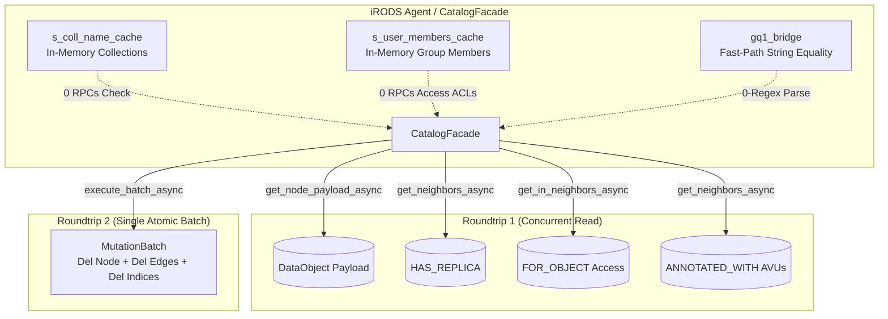

# Phase 7 Performance Domination Plan: 2-RPC Cleanup, 1-RPC Registration & Fast-Path GQ1 Bridge

> **For agentic workers:** REQUIRED SUB-SKILL: Use superpowers:subagent-driven-development to implement this plan task-by-task. Steps use checkbox (`- [ ]`) syntax for tracking.

**Goal:** Decisively outperform PostgreSQL 16 on all iRODS catalog operations by reducing `delete_data_object` from 9 RPCs to 2 RPCs, reducing `register_data_object` from 2 RPCs to 1 single atomic RPC via cached collection existence, and eliminating `std::regex` overhead in `gq1_bridge.cpp`.

**Architecture:**
Streamline catalog operations by eliminating redundant network roundtrips over ZeroMQ. DataObject nodes already contain parent collection ID, owner ID, and path indices; access nodes and initial replicas have deterministic snowflake IDs. By exploiting deterministic topology and caching the small working set of collection names in memory, mutations execute in atomic batches without probing the graph repeatedly.

**Architecture Diagram:**



**Tech Stack:** C++20, ZeroMQ, liblite3-cpp, L3KV, L3KVG Graph Database, iRODS 4.3.4 Database Plugin Interface.

## Global Constraints
- Strictly zero `nlohmann::json` across all modified paths.
- Pure binary `lite3cpp::Buffer` and native structs only.
- Thread-safety: all static caches must be protected by dedicated `std::mutex`.
- Backward compatibility: fall back gracefully if payload lacks cached fields.
- Two-stage review (Spec Review then Code Quality Review) mandatory for each task.

---

### Task 1: 2-RPC Streamlined `delete_data_object` in `catalog_facade.cpp`

**Files:**
- Modify: [`src/catalog/catalog_facade.cpp`](file:///home/darkfell/dev/irods_database_plugin_l3kvg/src/catalog/catalog_facade.cpp)
- Test: [`tests/test_catalog_facade_dml.cpp`](file:///home/darkfell/dev/irods_database_plugin_l3kvg/tests/test_catalog_facade_dml.cpp)

**Interfaces:**
- Consumes: `client_->get_node_payload_async`, `client_->get_neighbors_async`, `client_->get_in_neighbors_async`, `client_->execute_batch_async`.
- Produces: Streamlined `delete_data_object(data_id_t id)` executing exactly 2 network roundtrips for non-annotated objects.

- [ ] **Step 1: Inspect and verify existing DML test suite**
Run: `cd /home/darkfell/dev/irods_database_plugin_l3kvg/build_final && ./test_catalog_facade_dml`
Expected: PASS

- [ ] **Step 2: Store `uid` in DataObject payload in `register_data_object`**
In `src/catalog/catalog_facade.cpp`, ensure `buf.set_i64(0, "uid", static_cast<int64_t>(uid));` is written into the data object payload buffer so `delete_data_object` can read it directly from payload without querying `OWNS` in-neighbors.

- [ ] **Step 3: Refactor `delete_data_object` for 2-RPC execution**
In `src/catalog/catalog_facade.cpp`:
1. Roundtrip 1 (Concurrent Read):
   Launch in parallel:
   ```cpp
   auto f_payload = client_->get_node_payload_async(local_cluster_id_, sid);
   auto f_repl = client_->get_neighbors_async(local_cluster_id_, sid, "HAS_REPLICA", 0.0);
   auto f_access = client_->get_in_neighbors_async(local_cluster_id_, sid, "FOR_OBJECT");
   auto f_avus = client_->get_neighbors_async(local_cluster_id_, sid, "ANNOTATED_WITH", 0.0);
   ```
2. Unpack payload and delete deterministic edges directly into `l3kvg::MutationBatch`:
   - `cid`: delete `CONTAINS` edge from parent collection.
   - `uid`: delete `OWNS` edge from owner user.
   - Name, ID, path, and `pn` indices.
3. Unpack replicas: delete `HAS_REPLICA` edges and replica nodes.
4. Unpack accesses: for each `aid`, delete `HAS_ACCESS` edges (from `uid` and cached group members from `s_user_members_cache`), `FOR_OBJECT` edge to `sid`, and `aid` node.
5. Unpack AVUs: if `!avus.empty()`, only then query incoming references before deleting the metadata node. If empty, 0 additional RPCs.
6. Roundtrip 2 (Single Atomic Batch):
   `batch.del_node(sid);`
   `client_->execute_batch_async(local_cluster_id_, batch).get();`

- [ ] **Step 4: Build and test**
Run: `cmake --build /home/darkfell/dev/irods_database_plugin_l3kvg/build_final -j$(nproc)`
Run: `cd /home/darkfell/dev/irods_database_plugin_l3kvg/build_final && ./test_catalog_facade_dml && ./test_collections && ./test_plugin_acls`
Expected: PASS

- [ ] **Step 5: Commit**
`git -C /home/darkfell/dev/irods_database_plugin_l3kvg commit -am "perf(catalog): streamline delete_data_object to 2 RPC roundtrips"`

---

### Task 2: 1-RPC Negative-Cached Collection Existence in `register_data_object`

**Files:**
- Modify: [`src/catalog/catalog_facade.cpp`](file:///home/darkfell/dev/irods_database_plugin_l3kvg/src/catalog/catalog_facade.cpp)
- Test: [`tests/test_collections.cpp`](file:///home/darkfell/dev/irods_database_plugin_l3kvg/tests/test_collections.cpp)

**Interfaces:**
- Consumes: `s_coll_name_cache`, `s_path_cache_mu`, `client_->get_prefix_entries_async`.
- Produces: Zero network RPCs for collection existence check during data object registration.

- [ ] **Step 1: Add collection cache initialization and synchronization**
In `src/catalog/catalog_facade.cpp`:
1. Add `static bool s_coll_name_cache_initialized = false;` guarded by `s_path_cache_mu`.
2. In `register_data_object`:
   ```cpp
   bool coll_exists = false;
   {
       std::lock_guard<std::mutex> lock(s_path_cache_mu);
       if (!s_coll_name_cache_initialized) {
           auto entries = client_->get_prefix_entries_async(local_cluster_id_, "idx:Collection:n:").get();
           for (const auto& [k, v] : entries) {
               if (k.ends_with(":meta") || v.empty()) continue;
               std::string prefix = "idx:Collection:n:";
               if (k.rfind(prefix, 0) == 0) {
                   std::string cpath = k.substr(prefix.length());
                   try { s_coll_name_cache[cpath] = std::stoull(v, nullptr, 16); } catch(...) {}
               }
           }
           s_coll_name_cache_initialized = true;
       }
       auto it = s_coll_name_cache.find(full_path);
       if (it != s_coll_name_cache.end() && it->second != 0) {
           coll_exists = true;
       }
   }
   if (coll_exists) {
       return ERROR(CAT_NAME_EXISTS_AS_COLLECTION, "Collection already exists with data object name: " + full_path);
   }
   ```
3. Remove the redundant blocking `snowflake_id_t existing_coll = resolve_id_from_index(EntityType::Collection, "n", full_path);` call.
4. Ensure `create_collection`, `delete_collection`, and `rename_collection` update `s_coll_name_cache` under `s_path_cache_mu`.

- [ ] **Step 2: Build and run test suite**
Run: `cmake --build /home/darkfell/dev/irods_database_plugin_l3kvg/build_final -j$(nproc)`
Run: `cd /home/darkfell/dev/irods_database_plugin_l3kvg/build_final && ./test_collections && ./test_catalog_facade_dml`
Expected: PASS

- [ ] **Step 3: Commit**
`git -C /home/darkfell/dev/irods_database_plugin_l3kvg commit -am "perf(catalog): in-memory collection cache eliminating registration index roundtrip"`

---

### Task 3: Fast-Path String Equality & Literal Extraction in `gq1_bridge.cpp`

**Files:**
- Modify: [`src/gq1_bridge.cpp`](file:///home/darkfell/dev/irods_database_plugin_l3kvg/src/gq1_bridge.cpp)
- Test: [`tests/test_gq1_bridge.cpp`](file:///home/darkfell/dev/irods_database_plugin_l3kvg/tests/test_gq1_bridge.cpp)

**Interfaces:**
- Consumes: GenQuery1 `genQueryInp_t` condition strings.
- Produces: Zero-regex fast-path string parser for exact matches (`= '...'`, `= ...`).

- [ ] **Step 1: Implement `fast_parse_equality`**
In `src/gq1_bridge.cpp`:
Add helper function:
```cpp
static bool fast_parse_equality(std::string_view cond, std::string& out_literal) {
    size_t i = 0;
    while (i < cond.size() && std::isspace(static_cast<unsigned char>(cond[i]))) ++i;
    if (i >= cond.size() || cond[i] != '=') return false;
    ++i;
    if (i < cond.size() && (cond[i] == '=' || cond[i] == '<' || cond[i] == '>')) return false;
    while (i < cond.size() && std::isspace(static_cast<unsigned char>(cond[i]))) ++i;
    if (i >= cond.size()) return false;
    if (cond[i] == '\'') {
        ++i;
        size_t start = i;
        std::string res;
        res.reserve(cond.size() - i);
        while (i < cond.size()) {
            if (cond[i] == '\'') {
                if (i + 1 < cond.size() && cond[i + 1] == '\'') {
                    res += '\'';
                    i += 2;
                } else {
                    break; // closing quote
                }
            } else if (cond[i] == '\\' && i + 1 < cond.size()) {
                res += cond[i + 1];
                i += 2;
            } else {
                res += cond[i++];
            }
        }
        if (i < cond.size() && cond[i] == '\'') {
            ++i;
            while (i < cond.size() && std::isspace(static_cast<unsigned char>(cond[i]))) ++i;
            if (i == cond.size()) {
                out_literal = std::move(res);
                return true;
            }
        }
        return false;
    } else {
        size_t start = i;
        while (i < cond.size() && !std::isspace(static_cast<unsigned char>(cond[i]))) ++i;
        out_literal = std::string(cond.substr(start, i - start));
        while (i < cond.size() && std::isspace(static_cast<unsigned char>(cond[i]))) ++i;
        return (i == cond.size());
    }
}
```

- [ ] **Step 2: Use `fast_parse_equality` across `synthesize_gq2_ast`**
In `src/gq1_bridge.cpp`:
1. In Pass 0: for `COL_META_DATA_ATTR_NAME`, `COL_META_DATA_ATTR_VALUE`, `COL_COLL_NAME`, `COL_DATA_NAME`, check `fast_parse_equality(cond, literal)` before resorting to `std::regex_match`.
2. In Pass 2: check `fast_parse_equality` before evaluating `eq_regex`.

- [ ] **Step 3: Build and test**
Run: `cmake --build /home/darkfell/dev/irods_database_plugin_l3kvg/build_final -j$(nproc)`
Run: `cd /home/darkfell/dev/irods_database_plugin_l3kvg/build_final && ./test_gq1_bridge && ./test_plugin_genquery2`
Expected: PASS

- [ ] **Step 4: Commit**
`git -C /home/darkfell/dev/irods_database_plugin_l3kvg commit -am "perf(bridge): fast-path string equality parsing eliminating std::regex on hot queries"`

---

### Task 4: Package, Deploy & Benchmark against PostgreSQL 16

**Files:**
- Package: Debian package `irods-database-plugin-l3kvg-5.0.0-Linux.deb`
- Deploy target: Container `ubuntu-2404-l3kvg-irods-catalog-provider-1`
- Benchmark: `/home/darkfell/dev/irods_database_plugin_l3kvg/benchmarks/bench_catalog_comparison.py`

- [ ] **Step 1: Package Debian `.deb`**
Run: `cd /home/darkfell/dev/irods_database_plugin_l3kvg/build_final && cpack -G DEB`

- [ ] **Step 2: Deploy plugin and server to container**
1. Copy `.deb` to `ubuntu-2404-l3kvg-irods-catalog-provider-1:/tmp/` and install with `dpkg -i`.
2. Copy `l3kvg_server` to `/usr/bin/l3kvg_server`.
3. Restart `l3kvg_server` and `irodsServer`.
4. Run quick sanity test: `docker exec -u rods ubuntu-2404-l3kvg-irods-catalog-provider-1 ils`.

- [ ] **Step 3: Run 1K Catalog Benchmark**
Run: `cd /home/darkfell/dev/irods_database_plugin_l3kvg/benchmarks && python3 bench_catalog_comparison.py --tiers 1k --backends both --iterations 1`
Verify latency numbers for `cleanup`, `registration`, `metadata`, `avu_lookup`, `mkdir`, and `ils`.
Save results to `benchmarks/benchmark_results_phase7.json`.
