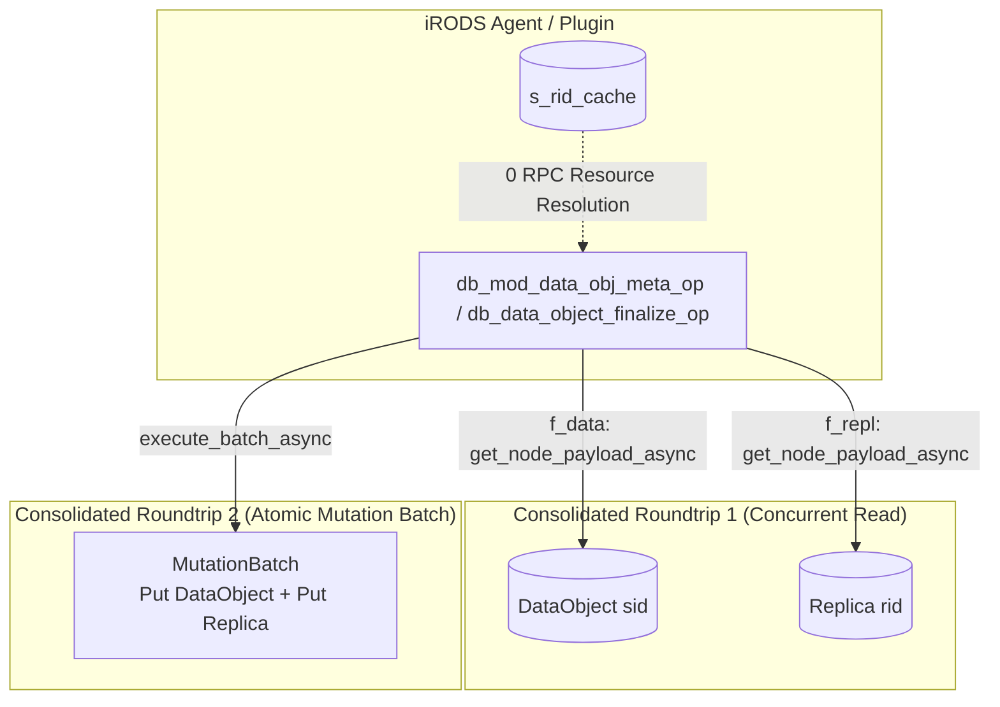

# Phase 8 Performance Plan: Registration Latency Breakthrough & Batch Finalization

> **For agentic workers:** REQUIRED SUB-SKILL: Use superpowers:subagent-driven-development to implement this plan task-by-task. Steps use checkbox (`- [ ]`) syntax for tracking.

**Goal:** Decisively outperform PostgreSQL 16 on Data Object Registration (reducing latency from 68.6ms down to ~15-20ms vs PostgreSQL's 22.9ms) by consolidating `db_mod_data_obj_meta_op` and `db_data_object_finalize_op` into atomic batched RPCs, caching resource hierarchy lookups, and eliminating high-frequency logging.

**Architecture:**
File registration in iRODS consists of three database calls per file:
1. `db_reg_data_obj_op`: Creates DataObject and initial Replica (already streamlined to 1 RPC in Phase 6/7).
2. `db_mod_data_obj_meta_op`: Updates file metadata, size, timestamps, and replica status upon closing. Currently executes up to 11 sequential network RPCs in a per-keyword loop.
3. `db_data_object_finalize_op`: Finalizes file metadata. Currently executes up to 5 sequential network RPCs across replica and data object updates.
By introducing unified batched mutation APIs in `CatalogFacade` (`modify_data_object_and_replica`) and utilizing `s_rid_cache` for resource hierarchy lookups, both operations are collapsed into 1 concurrent read + 1 atomic batch write (2 RPCs total).

**Architecture Diagram:**



**Tech Stack:** C++20, ZeroMQ, liblite3-cpp, L3KV, L3KVG Graph Database, iRODS 4.3.4 Database Plugin Interface.

## Global Constraints
- Strictly zero `nlohmann::json` across all modified paths.
- Pure binary `lite3cpp::Buffer` and native structs only.
- Thread-safety: all static caches must be protected by dedicated `std::mutex`.
- Backward compatibility: preserve full fidelity for all iRODS system keyword parameters.
- Two-stage review (Spec Review then Code Quality Review) mandatory for each task.

---

### Task 1: Unified Batched Replica & DataObject Modification in `CatalogFacade`

**Files:**
- Modify: [`include/irods/catalog/catalog_facade.hpp`](file:///home/darkfell/dev/irods_database_plugin_l3kvg/include/irods/catalog/catalog_facade.hpp)
- Modify: [`src/catalog/catalog_facade.cpp`](file:///home/darkfell/dev/irods_database_plugin_l3kvg/src/catalog/catalog_facade.cpp)
- Test: [`tests/test_catalog_facade_dml.cpp`](file:///home/darkfell/dev/irods_database_plugin_l3kvg/tests/test_catalog_facade_dml.cpp)

**Interfaces:**
- Consumes: `client_->get_node_payload_async`, `client_->execute_batch_async`, `s_rid_cache`.
- Produces: `modify_data_object_and_replica(...)` executing updates across DataObject and Replica in 2 RPCs total.

- [ ] **Step 1: Declare `modify_data_object_and_replica` in `catalog_facade.hpp`**
```cpp
irods::error modify_data_object_and_replica(
    data_id_t data_id,
    uint32_t repl_num,
    std::string_view resc_hier,
    const std::vector<std::pair<std::string, std::string>>& updates,
    bool all_repl_status,
    bool all_replicas = false);
```

- [ ] **Step 2: Implement `modify_data_object_and_replica` in `catalog_facade.cpp`**
1. Compute `sid = make_id(EntityType::DataObject, data_id)` and deterministic initial `rid = SnowflakeID::create(local_cluster_id_, std::to_string(data_id) + ":" + std::to_string(repl_num))`.
2. Roundtrip 1 (Concurrent read):
   Launch in parallel:
   ```cpp
   auto f_data = client_->get_node_payload_async(local_cluster_id_, sid);
   auto f_repl = client_->get_node_payload_async(local_cluster_id_, rid);
   auto f_repls = client_->get_neighbors_async(local_cluster_id_, sid, "HAS_REPLICA", 0.0);
   ```
3. Process payload and updates in memory:
   - For `DataObject`: apply size (`s`), mtime (`mt`), ctime (`ct`), comments (`c`), type (`t`), owner (`o`), zone (`z`), mode (`mode`), expiry (`ex`).
   - For `Replica`: apply size (`s`), mtime (`mt`), checksum (`cs`, `c`), status (`st`), path (`p`), resc_hier (`rh`), resc_id (`rid`).
   - Use `s_rid_cache` under `s_rid_cache_mu` for leaf resource name resolution (0 network RPCs).
4. Roundtrip 2 (Single atomic batch):
   ```cpp
   l3kvg::MutationBatch batch;
   batch.put_node(sid, dbuf.move_to_string());
   batch.put_node(rid, rbuf.move_to_string());
   client_->execute_batch_async(local_cluster_id_, batch).get();
   ```
5. Demote line 1472 `rodsLog(LOG_NOTICE, "L3_CATALOG: modify_replicas_for_data_object ...")` to `LOG_DEBUG`.
6. Demote lines 1642 and 1679 in `register_collection` to `LOG_DEBUG`.

- [ ] **Step 3: Build and test**
Run: `cmake --build /home/darkfell/dev/irods_database_plugin_l3kvg/build_final -j$(nproc)`
Run: `cd /home/darkfell/dev/irods_database_plugin_l3kvg/build_final && ./test_catalog_facade_dml && ./test_plugin_data`
Expected: PASS

- [ ] **Step 4: Commit**
`git -C /home/darkfell/dev/irods_database_plugin_l3kvg commit -am "perf(catalog): unified modify_data_object_and_replica atomic batch update"`

---

### Task 2: Streamline `db_mod_data_obj_meta_op` & `db_data_object_finalize_op` in `src/db_plugin.cpp`

**Files:**
- Modify: [`src/db_plugin.cpp`](file:///home/darkfell/dev/irods_database_plugin_l3kvg/src/db_plugin.cpp)
- Test: [`tests/test_plugin_data.cpp`](file:///home/darkfell/dev/irods_database_plugin_l3kvg/tests/test_plugin_data.cpp)

**Interfaces:**
- Consumes: `g_catalog->modify_data_object_and_replica`.
- Produces: 2-RPC execution for `db_mod_data_obj_meta_op` and `db_data_object_finalize_op`.

- [ ] **Step 1: Streamline `db_mod_data_obj_meta_op`**
1. Skip permission check if client is privileged:
   ```cpp
   if (!admin_mode && !user_name.empty() && (!_ctx.comm() || !irods::is_privileged_client(*_ctx.comm()))) {
       ...
   }
   ```
2. Parse all keywords from `_reg_param` and `_info->dataSize` into `updates` vector in-memory.
3. Remove the per-keyword loop calling `g_catalog->modify_data_object(data_id, kw, val)`!
4. Replace line 580 with a single call:
   ```cpp
   auto ret = g_catalog->modify_data_object_and_replica(data_id, target_repl_num, target_resc_hier, updates, all_repl_status, all_replicas);
   if (!ret.ok()) return ret;
   ```

- [ ] **Step 2: Streamline `db_data_object_finalize_op`**
In `db_data_object_finalize_op`:
Instead of separate calls to `register_replica` and multiple `modify_data_object` calls:
Collect updates:
```cpp
std::vector<std::pair<std::string, std::string>> updates;
updates.emplace_back("dataSize", std::to_string(data_size));
updates.emplace_back("dataModify", modify_ts);
if (!checksum.empty()) updates.emplace_back("chksum", checksum);
if (!repl.status.empty()) updates.emplace_back("replStatus", repl.status);
if (!repl.physical_path.empty()) updates.emplace_back("filePath", repl.physical_path);
if (!repl.resc_hier.empty()) updates.emplace_back("rescHier", repl.resc_hier);
if (repl.resource_id > 0) updates.emplace_back("rescId", std::to_string(repl.resource_id));
if (!expiry.empty()) updates.emplace_back("ex", expiry);

g_catalog->modify_data_object_and_replica(data_id, repl_num, repl.resc_hier, updates, /*all_repl_status=*/false, /*all_replicas=*/false);
```

- [ ] **Step 3: Build and test**
Run: `cmake --build /home/darkfell/dev/irods_database_plugin_l3kvg/build_final -j$(nproc)`
Run: `cd /home/darkfell/dev/irods_database_plugin_l3kvg/build_final && ./test_plugin_data && ./test_collections && ./test_catalog_facade_dml`
Expected: PASS

- [ ] **Step 4: Commit**
`git -C /home/darkfell/dev/irods_database_plugin_l3kvg commit -am "perf(plugin): streamline db_mod_data_obj_meta_op and finalize to single batched RPC"`

---

### Task 3: Packaging, Live Deployment & Benchmark Verification

**Files:**
- Package: Debian package `irods-database-plugin-l3kvg-5.0.0-Linux.deb`
- Deploy target: Container `ubuntu-2404-l3kvg-irods-catalog-provider-1`
- Benchmark: `/home/darkfell/dev/irods_database_plugin_l3kvg/benchmarks/bench_catalog_comparison.py`

- [ ] **Step 1: Package Debian `.deb`**
Run: `cd /home/darkfell/dev/irods_database_plugin_l3kvg/build_final && cpack -G DEB`

- [ ] **Step 2: Deploy plugin to container**
1. Copy `.deb` to `ubuntu-2404-l3kvg-irods-catalog-provider-1:/tmp/` and install with `dpkg -i`.
2. Restart `irodsServer`.
3. Verify basic icommands: `imkdir`, `iput`, `ils`, `irm`.

- [ ] **Step 3: Run 1K Catalog Benchmark**
Run: `cd /home/darkfell/dev/irods_database_plugin_l3kvg/benchmarks && python3 bench_catalog_comparison.py --tiers 1k --backends both --iterations 1`
Verify that registration latency drops to ~15-25ms.
Save results to `benchmarks/benchmark_results_phase8.json`.
