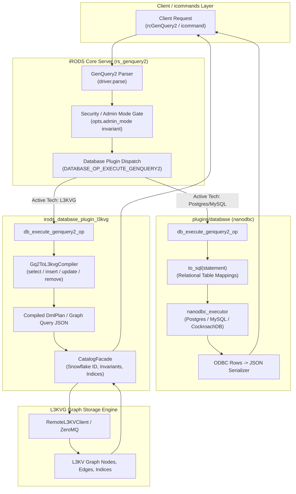

# Design Specification: iRODS L3KVG Database Plugin Support & Core Architectural Parity

**Author:** Antigravity AI Engine & Darkfell  
**Date:** 2026-09-27  
**Branch:** `feature/l3kvg-database-plugin-support`  
**Target Repositories:** 
- `/home/darkfell/dev/irods` (Core Server & Catalog Interfaces)
- `/home/darkfell/dev/irods_database_plugin_l3kvg` (Target Plugin)

---

## 1. Executive Summary

The modernization of the iRODS 5.1 catalog introduces GenQuery2 DML statements (`insert`, `update`, `remove`) and abstract syntax tree (AST) queries. Historically, the iRODS core server compiled GenQuery2 AST queries directly into SQL strings (`to_sql()`), embedding relational assumptions into the core server and forcing non-relational database plugins to either emulate SQL or operate via fragmented out-of-band interfaces.

This specification establishes **true database-agnostic architectural parity** between relational plugins (`irods_database_plugin_postgres` / `nanodbc`) and native graph plugins (`irods_database_plugin_l3kvg`). By introducing a native AST-level dispatch operation (`DATABASE_OP_EXECUTE_GENQUERY2`), moving relational SQL codegen into the `nanodbc` plugin, extending the L3KVG compiler (`Gq2ToL3kvgCompiler`) to compile DML ASTs into graph mutations, and decoupling the plugin build system, both database architectures become first-class catalog backends in iRODS 5.1.

---

## 2. Architecture & Data Flow



---

## 3. Subsystem Breakdown & Interfaces

### 3.1 Core Server Changes (`/home/darkfell/dev/irods`)

1. **Operation Registration & Constants**:
   - In `server/core/include/irods/irods_database_constants.hpp`:
     ```cpp
     const std::string DATABASE_OP_EXECUTE_GENQUERY2{"database_execute_genquery2"};
     ```
   - Plugin operation signature:
     ```cpp
     std::function<irods::error(
         irods::plugin_context&,
         const irods::experimental::genquery2::statement*,
         const irods::experimental::genquery2::options*,
         char**)>
     ```

2. **Server API Dispatch (`server/api/src/rs_genquery2.cpp`)**:
   - The server parses the input query string into `irods::experimental::genquery2::driver`.
   - The security invariant gate checks client privileges (`opts.admin_mode`) for modification queries.
   - `rs_genquery2` resolves the database plugin and invokes `DATABASE_OP_EXECUTE_GENQUERY2`.
   - Core has zero references to relational SQL generation, achieving full decoupling.

3. **Relational Backend Relocation**:
   - Move `server/genquery2/src/genquery2_sql.cpp` and `include/irods/private/genquery2_table_column_mappings.hpp` from core into `plugins/database/src/`.
   - In `plugins/database/src/db_plugin.cpp`, implement `db_execute_genquery2_op` by calling `to_sql()` and executing via `nanodbc_executor`.

---

### 3.2 L3KVG Plugin Modernization (`/home/darkfell/dev/irods_database_plugin_l3kvg`)

1. **Plugin Interface Implementation (`src/db_plugin.cpp`)**:
   - Register `DATABASE_OP_EXECUTE_GENQUERY2`:
     ```cpp
     add_operation<const irods::experimental::genquery2::statement*,
                   const irods::experimental::genquery2::options*,
                   char**>(
         irods::DATABASE_OP_EXECUTE_GENQUERY2,
         std::function<irods::error(irods::plugin_context&,
                                    const irods::experimental::genquery2::statement*,
                                    const irods::experimental::genquery2::options*,
                                    char**)>(db_execute_genquery2_op));
     ```

2. **DML AST Compiler (`include/irods/catalog/gq2_compiler.hpp`, `src/compiler/gq2_compiler.cpp`)**:
   - Define `DmlPlan`:
     ```cpp
     enum class DmlAction { Insert, Update, Remove };
     
     struct DmlPlan {
         DmlAction action;
         std::string entity_type; // e.g. "DataObject", "Collection", "User"
         std::vector<std::pair<std::string, std::string>> properties; // key -> value
         std::vector<std::pair<std::string, std::string>> conditions; // where filter
         std::vector<std::string> target_edges; // e.g. parent collection, owner
     };
     ```
   - Extend `Gq2ToL3kvgCompiler` with AST visitors:
     - `std::string compile(const genquery2::select& ast, ...);` (existing query compiler)
     - `DmlPlan compile(const genquery2::insert& ast);`
     - `DmlPlan compile(const genquery2::update& ast);`
     - `DmlPlan compile(const genquery2::remove& ast);`
     - `DmlPlan compile(const genquery2::statement& ast);`

3. **Catalog Facade Execution (`include/irods/catalog/catalog_facade.hpp`, `src/catalog/catalog_facade.cpp`)**:
   - Add `irods::error execute_dml(const DmlPlan& plan, nlohmann::json& out_result);`
   - Invariant enforcement:
     - **Snowflake ID Generation**: Generate deterministic or sequence-based snowflake IDs for new nodes.
     - **Index Maintenance**: Update `idx:type:<type>` and property indices (`idx:<Entity>:<attr>:<val>`).
     - **Edge Reciprocity**: Maintain hierarchical edges (`COLLECTION_CONTAINS`, `HAS_REPLICA`, `OWNED_BY`).
     - **Tombstoning / Cascade**: Clean up orphaned edges on `Remove`.

4. **CMake Modernization (`CMakeLists.txt`)**:
   - Remove legacy relative references to `../irods_dev/irods`.
   - Provide dual-mode support:
     ```cmake
     find_package(IRODS QUIET)
     if(NOT IRODS_FOUND)
         set(IRODS_DIR "${CMAKE_CURRENT_SOURCE_DIR}/../irods" CACHE PATH "Path to iRODS source tree")
         # Configure includes and libraries from local IRODS_DIR
     endif()
     ```
   - Link against `irods_server` and `irods_common` rather than compiling duplicate lexer/parser sources.

5. **Legacy Icommand Parity & Fixes**:
   - Address permission validation gap in `imkdir` for non-admin users in `CatalogFacade`.
   - Validate CRUD operations (`iput`, `iget`, `icp`, `imv`, `irm`) against the L3KVG catalog engine.

---

## 4. Code Property Graph (CPG) Verification Protocol

To guarantee software integrity across both repositories, changes must follow the 4-Phase CPG Engineering Loop (`cpg-orchestrated-workflow`):

```
+-----------------------------------------------------------------------------------------------+
|                                  CPG VERIFICATION GATES                                       |
|                                                                                               |
| Phase 1: Semantic Discovery (`cpg-codebase-discovery`)                                        |
|   - Map symbol definitions for `statement`, `select`, `insert`, `update`, `remove`.           |
|   - Confirm AST node coordinates in `irods` and `irods_database_plugin_l3kvg`.                |
|                                                                                               |
| Phase 2: Blast Radius & Impact Analysis (`cpg-impact-analysis`)                               |
|   - Forward slice from `rs_genquery2.cpp` through `DATABASE_OP_EXECUTE_GENQUERY2`.            |
|   - Prove `NoAlias` between input AST variant pointers and output JSON buffer buffers.        |
|                                                                                               |
| Phase 3: Transformation & Lifecycle Sync (`cpg-ast-refactoring` + `cpg-lifecycle-sync`)       |
|   - Apply code changes to `irods` and `irods_database_plugin_l3kvg`.                          |
|   - Invoke `insight_notify_files_changed` immediately following edits.                        |
|   - Compile with zero warnings under Clang/GCC C++20.                                         |
|                                                                                               |
| Phase 4: Formal Safety Verification (`cpg-safety-verification`)                               |
|   - Run `insight_analyze_concurrency` (`verify_smt: true`) on L3KVG client thread pool.       |
|   - Verify RAII ownership (`insight_infer_ownership`) on allocated JSON char* buffers.        |
|   - Execute unit and integration test suites.                                                 |
+-----------------------------------------------------------------------------------------------+
```

---

## 5. Testing & Qualification Strategy

1. **Unit Tests**:
   - `test_gq2_compiler`: Test compilation of `insert`, `update`, `remove` ASTs into `DmlPlan`.
   - `test_gq2_metadata_compiler`: Verify AVU updates via GenQuery2 DML.
   - `test_catalog_invariants`: Verify Snowflake ID and index consistency during multi-threaded mutations.
2. **Integration Tests**:
   - `test_rc_genquery2_l3kvg`: Test end-to-end client calls to `rcGenQuery2` against an active L3KVG plugin instance.
   - `test_legacy_compatibility`: Full pass of standard icommand test suite (`test_ils`, `test_iput`, `test_imkdir`, `test_ichmod`).

---

## 6. Migration & Rollback Plan

- **Feature Branch Isolation**: All work is isolated on `feature/l3kvg-database-plugin-support` across both repositories.
- **Rollback**: If any invariant check fails or backward compatibility breaks, the branch can be rolled back without impacting mainline 5.1 development.
