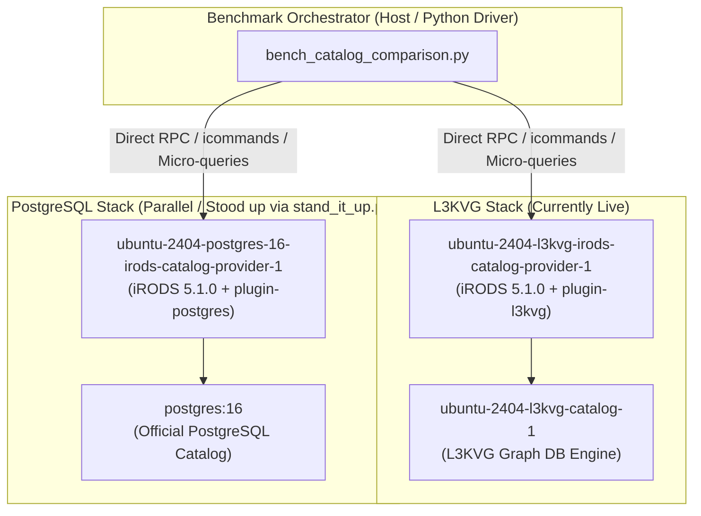

# Design Spec: iRODS L3KVG vs Relational Database (PostgreSQL 16) Performance Investigation

**Date:** 2026-10-02  
**Status:** Approved  
**Author:** Antigravity  

---

## 1. Executive Summary & Objective

With the `irods-database-plugin-l3kvg` successfully passing 100% of integration and unit test suites across all 38 test suites, this project establishes a rigorous, automated comparative benchmark between the graph-based **L3KVG catalog backend** and the traditional **PostgreSQL 16 relational catalog backend**.

The goal is to evaluate:
1. **End-to-End iRODS Operation Throughput & Latency:** Compare real-world icommand and API workflows (tree creation, bulk object registration, recursive directory walks, metadata queries, and GenQuery branching joins) under identical server conditions.
2. **Direct Engine Latency:** Isolate catalog engine transaction and traversal speed from iRODS RPC and rule-engine overhead.
3. **Scaling Behavior ($O(1)$ vs $O(\log N)$ vs $O(N)$):** Profile index degradation, memory footprint, and disk amplification across scaling tiers (1K, 10K, and 50K–100K objects).

---

## 2. Environment & Architectural Equivalence

To guarantee fair, reproducible, and zero-bias comparisons, both database backends are hosted on the identical Linux host kernel inside standardized Docker Compose environments managed by `irods_testing_environment`.



### Component Matrix

| Component | L3KVG Stack | PostgreSQL 16 Stack |
|---|---|---|
| **OS Distribution** | Ubuntu 24.04 (Noble Numbat) | Ubuntu 24.04 (Noble Numbat) |
| **iRODS Server & Runtime** | `5.1.0-0~noble_amd64` | `5.1.0-0~noble_amd64` |
| **iRODS icommands** | `5.1.0-0~noble_amd64` | `5.1.0-0~noble_amd64` |
| **Database Plugin** | `irods-database-plugin-l3kvg` (v5.0.0) | `irods-database-plugin-postgres` (v5.1.0) |
| **Database Backend** | L3KVG In-Memory / WAL Graph Engine | PostgreSQL 16 Official Docker Image |
| **Vault Storage** | Shared Docker volume (`shared_volume`) | Shared Docker volume (`shared_volume`) |

---

## 3. Workload Specifications & Multi-Tier Scale Sweep

### Scale Sweep Tiers
The benchmark executes identical workloads across three scaling tiers to evaluate performance under varying catalog densities:
* **Tier 1 (Small / Warmup):** 1,000 data objects across 50 collections (shallow hierarchy, max depth 2).
* **Tier 2 (Medium / Standard):** 10,000 data objects across 200 collections (mixed hierarchy, max depth 5).
* **Tier 3 (Large / Scale):** 50,000 to 100,000 data objects across 1,000 collections (deep hierarchy, max depth 10).

### Workload Definitions

#### A. Macro Workloads (End-to-End iRODS Operations)
*Payload Isolation:* All file creations use zero-byte files (`itouch` or empty `iput`) to ensure network data transfer and disk payload writing do not skew catalog transaction measurements.

1. **Hierarchy Creation (`imkdir -p`):**
   - Measures deep nested path creation ($D=10$) and wide fanout ($F=100$).
   - Evaluates graph edge linking vs relational parent collection foreign key index lookups.
2. **Bulk Registration (`itouch` / `iput`):**
   - Pipelined batch insertion of objects across generated collections.
   - Evaluates `r_data_main` row insertion + trigger constraints vs L3KVG `put_node` + `CONTAINS` edge creation.
3. **Hierarchical Listing & Tree Traversal (`ils -r`, `ils -l`):**
   - Recursive walk of full directory subtrees from collection roots.
   - Evaluates graph depth-first/breadth-first pointer traversal vs SQL recursive CTEs or `WHERE coll_name LIKE ...` queries.
4. **Metadata Tagging (`imeta add`):**
   - Appending 1 to 5 AVU triplets (Attribute, Value, Unit) to each data object.
   - Evaluates L3KVG property maps/hyper-edges vs relational `r_meta_main` + `r_objt_metamap` joins.
5. **Metadata Search (`imeta qu` / `iquest`):**
   - Exact match lookups (`imeta qu -d attr = val`), prefix queries, and multi-attribute conjunctions.
   - Evaluates graph index scans vs B-tree table scans and index joins.
6. **Branching Joins (GenQuery `OBJ_STAT`):**
   - Multi-table lookups joining DataObject $\to$ Replica and DataObject $\to$ Collection.
   - Evaluates L3KVG branching graph query execution vs relational 3-way SQL joins.
7. **Recursive Cleanup (`irm -r`, `irmtrash`):**
   - Deletion of test collections and emptying of the trash can.
   - Evaluates graph edge cascade deletion vs relational cascade foreign-key deletions.

#### B. Micro Workloads (Direct Engine Profiling)
Directly tests database backends bypassing iRODS RPC serialization:
- **Point Lookups:** ID-based lookups (`Engine::get_node` vs `SELECT * FROM r_data_main WHERE data_id = ?`).
- **Hierarchy Resolution:** Resolving canonical collection path from leaf ID (parent edge traversal vs relational parent CTE).
- **Branching Joins:** Graph traversal branching vs SQL query engine execution plan.

---

## 4. Benchmark Harness Design

### Architecture of `bench_catalog_comparison.py`
The driver is written in Python 3 with zero external package dependencies outside standard library and `docker` SDK / subprocess.

```
bench_catalog_comparison.py
├── Configuration & Arguments Parsing (--tiers, --backends, --iterations)
├── Environment Controller (health-checks L3KVG and stands up/down PostgreSQL)
├── Workload Executor
│   ├── run_collection_workload()
│   ├── run_registration_workload()
│   ├── run_traversal_workload()
│   ├── run_metadata_workload()
│   └── run_query_workload()
├── Measurement & Sampling Probe (high-res monotonic timing, memory polling)
└── Report & JSON Generator (generates benchmark_results.json and markdown summary)
```

### Execution Protocol
1. **Warmup Phase:** 100 untimed operations to eliminate cold-start cache anomalies and prime memory mappings.
2. **Measurement Phase:** 5 independent iterations per workload tier; captures per-operation duration using `time.perf_counter_ns()`.
3. **Statistical Aggregation:** Computes Mean, Median ($p_{50}$), 95th Percentile ($p_{95}$), 99th Percentile ($p_{99}$), and Standard Deviation ($\sigma$).
4. **State Reset & Isolation:** Explicit collection deletion (`irm -rf`) and trash purging (`irmtrash -M -f`) between tiers to ensure pristine initial state for every tier.

---

## 5. Metrics & Reporting

### Primary Metrics
* **Latency Distribution:** $p_{50}$, $p_{95}$, $p_{99}$, Mean (microseconds / milliseconds).
* **Throughput:** Operations per second ($\text{ops/s} = \frac{N}{\Delta t}$).
* **Speedup Factor:**
  $$\text{Speedup} = \frac{\text{Latency}_{\text{Postgres}}}{\text{Latency}_{\text{L3KVG}}}$$
  (Values $> 1.0\times$ indicate L3KVG performance advantage).
* **Storage Footprint:** Disk space consumed on disk for $N$ records (L3KVG `.db` + WAL vs PostgreSQL data directory / tablespace).
* **Memory RSS:** Peak Resident Set Size of the database processes during peak traversal load.

### Output Artifacts
- **Structured JSON:** `benchmark_results.json` documenting raw samples, configurations, and summary statistics.
- **Markdown Report:** Comprehensive summary artifact containing Markdown comparison tables, speedup ratios, and Mermaid charts.

---

## 6. Safety, Isolation & Teardown

1. **Non-destructive:** All benchmark files and collections will be isolated under `/tempZone/home/rods/bench_<uuid>/`.
2. **Container Lifecycle:** The PostgreSQL environment will be stood up with an explicit project name (`test-postgres16-bench`) to ensure no interference with the running L3KVG container cluster.
3. **Automated Teardown:** After benchmark completion, the test collections are purged, and the temporary Postgres cluster can be cleanly shut down via `docker compose down -v`.
