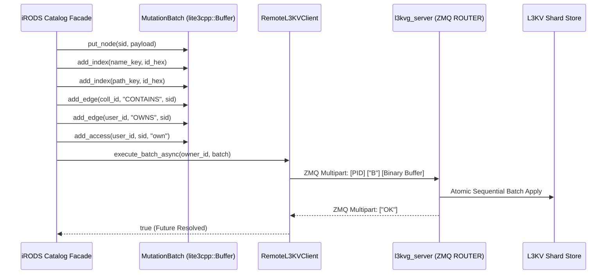

# Multi-Mutation IPC Batching Design

## 1. Overview & Problem Statement
During benchmark analysis of the **iRODS L3KVG graph catalog database plugin**, object registration throughput was profiled at **~2.9–5.0 ops/sec** (compared to PostgreSQL 16 at **~45 ops/sec**). 

Investigation revealed that registering a single data object in [`catalog_facade.cpp`](file:///home/darkfell/dev/irods_database_plugin_l3kvg/src/catalog/catalog_facade.cpp#L701-L780) executes **15 to 20 separate synchronous ZeroMQ IPC calls** (`put_node_async(...).get()`, `put_edge_async(...).get()`, `add_index(...).get()`). Because each call synchronously blocks on socket I/O, IPC thread switching, and shard queue dispatch, the engine incurs a ~15–20 ms roundtrip penalty per call. This establishes an artificial latency floor of ~300 ms per file.

This design introduces a high-throughput, zero-copy **Multi-Mutation Batching** mechanism that collapses all atomic mutations for an entity into a **single IPC roundtrip** using the binary `"B"` opcode and `lite3cpp::Buffer`.

---

## 2. Architecture & Wire Protocol



### 2.1 Wire Format (ZMQ Frames)
The communication between `RemoteL3KVClient` and `l3kvg_server` uses the existing ZeroMQ ROUTER/DEALER socket architecture:
```text
[Frame 0]: Identity (ROUTER socket routing envelope)
[Frame 1]: Delimiter (Empty frame: 0 bytes)
[Frame 2]: Principal ID (uint32_t, 4 bytes, little-endian)
[Frame 3]: Opcode ("B", 1 ASCII byte, 0x42)
[Frame 4]: Binary Payload (lite3cpp::Buffer serialized bytes)
```

### 2.2 Buffer Row Schema
Mutations are packed as tabular rows within `lite3cpp::Buffer`. Each row defines one atomic storage mutation:

| Field Name | Type | Value Range / Purpose |
| :--- | :--- | :--- |
| `op` | `int64` | `0` = PUT_RAW, `1` = PUT_NODE, `2` = ADD_EDGE, `3` = DEL_RAW, `4` = DEL_NODE, `5` = DEL_EDGE |
| `k` | `string` | Key name (used for RAW and INDEX mutations, e.g. `idx:DataObject:n:foo`) |
| `v` | `string`/`bytes`| Value payload (JSON node payload, hex string, or edge property) |
| `src` | `int64` | Source snowflake ID (for node and edge operations) |
| `dst` | `int64` | Destination snowflake ID (for edge operations) |
| `lbl` | `string` | Edge relationship label (e.g. `CONTAINS`, `OWNS`, `HAS_ACCESS`) |
| `w` | `float64`| Edge traversal weight (default `1.0`) |

---

## 3. Component Design & Interfaces

### 3.1 `MutationBatch` Builder (`l3kvg/include/L3KVG/MutationBatch.hpp`)
A builder class providing fluent, type-safe mutation staging:

```cpp
namespace l3kvg {

enum class MutationOp : uint8_t {
    PutRaw = 0,
    PutNode = 1,
    AddEdge = 2,
    DelRaw = 3,
    DelNode = 4,
    DelEdge = 5
};

class MutationBatch {
public:
    MutationBatch();

    void put_raw(std::string_view key, std::string_view value);
    void put_node(uint64_t node_id, std::string_view payload);
    void add_edge(uint64_t src, std::string_view label, double weight, uint64_t dst, std::string_view payload = "{}");
    void add_index(std::string_view key, std::string_view value_hex);
    
    void del_raw(std::string_view key);
    void del_node(uint64_t node_id);
    void del_edge(uint64_t src, std::string_view label, double weight, uint64_t dst);

    [[nodiscard]] const lite3cpp::Buffer& get_buffer() const noexcept { return buf_; }
    [[nodiscard]] size_t size() const noexcept { return count_; }
    [[nodiscard]] bool empty() const noexcept { return count_ == 0; }
    void clear();

private:
    lite3cpp::Buffer buf_;
    size_t count_ = 0;
};

} // namespace l3kvg
```

### 3.2 Server-Side Execution (`l3kvg/src/server/main.cpp` & `Engine.cpp`)
In `l3kvg_server`:
1. Receive opcode `"B"` and extract `lite3cpp::Buffer` payload.
2. In `Engine::apply_batch(const lite3cpp::Buffer& buffer, uint32_t principal_id)`:
   - Read row count `buffer.row_count()`.
   - Iterate rows from `0` to `count - 1`:
     - If `op == PutRaw`: execute `store_->put(k, v)`.
     - If `op == PutNode`: execute `put_node(src, v)`.
     - If `op == AddEdge`: execute `add_edge(src, lbl, w, dst, v)`.
     - If `op == DelRaw`: execute `store_->del(k)`.
     - If `op == DelNode`: execute `del_node(src)`.
     - If `op == DelEdge`: execute `del_edge(src, lbl, w, dst)`.
3. Respond `[Identity] [] ["OK"]`.

### 3.3 Client Integration (`l3kvg/src/RemoteL3KVClient.cpp`)
Connect `RemoteL3KVClient::execute_batch_async`:
```cpp
std::future<bool> RemoteL3KVClient::execute_batch_async(
    lite3::NodeID owner_id,
    const MutationBatch& batch,
    uint32_t principal_id
) {
    if (batch.empty()) {
        std::promise<bool> p; p.set_value(true); return p.get_future();
    }
    return put_batch_binary_async(owner_id, batch.get_buffer(), principal_id);
}
```

### 3.4 Catalog Facade Optimization (`irods_database_plugin_l3kvg/src/catalog/catalog_facade.cpp`)
Refactor `register_data_object`, `register_collection`, and `set_access`:
- Initialize `l3kvg::MutationBatch batch;`.
- Stage node data, secondary index keys, forward/reverse containment edges, and owner access grants into `batch`.
- Dispatch via `client_->execute_batch_async(local_cluster_id_, batch).get();`.
- Total roundtrips per object: **1** (down from 15–20).

---

## 4. Error Handling & Edge Cases

1. **Empty Batch:**
   - If `batch.empty()`, return immediate `true` without network traffic.
2. **Partial Failures / Malformed Buffers:**
   - If `lite3cpp::Buffer` fails deserialization or contains invalid UTF-8/binary data, server catches exception, logs error, and responds with `ERR:MALFORMED_BUFFER`.
3. **Cluster Shard Isolation:**
   - For federated or multi-node clusters, `EdgeCoordinator` splits mutations by destination owner ID before dispatching sub-batches to respective peer nodes.

---

## 5. Verification & Testing Plan

1. **Phase 1: Unit Testing in L3KVG**
   - File: `l3kvg/tests/test_mutation_batch.cpp`
   - Test Cases:
     - `test_batch_empty`: Validates no-op behavior on empty batches.
     - `test_batch_packing`: Validates `MutationBatch` correctly encodes all operation types into `lite3cpp::Buffer`.
     - `test_engine_apply_batch`: Tests `Engine::apply_batch` applies raw keys, node payloads, and directed edges into `Store` and `Graph` state.
2. **Phase 2: Plugin Regression & Test Harness**
   - File: `irods_database_plugin_l3kvg/build_final/test_repro_imkdir`, `test_store`, `test_gq1_bridge`.
   - Verify that existing catalog tests pass with 100% fidelity.
3. **Phase 3: Live Benchmark Validation**
   - Run `bench_catalog_comparison.py --tiers test_small --backends l3kvg` to assert functional parity.
   - Run 1 iteration of `--tiers 1k` to measure throughput speedup (expected increase from ~3.5 ops/s to 40–80+ ops/s).
